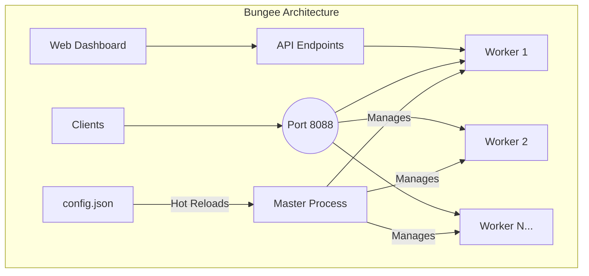

<div align="center">
  <pre>
    ____
   / __ )____  ____  __  __
  / __  / __ \/ __ \/ / / /
 / /_/ / /_/ / /_/ / /_/ /
/_____/\____/\____/\__,_/

  </pre>
  <h1>Bungee</h1>
  <p><strong>A high-performance, configurable reverse proxy server built for the Bun runtime.</strong></p>

  <p>
    <a href="https://github.com/jeffusion/bungee/actions/workflows/ci.yml">
      
    </a>
    <a href="https://github.com/jeffusion/bungee/releases">
      
    </a>
    <a href="https://github.com/jeffusion/bungee/blob/main/LICENSE">
      
    </a>
    <a href="https://github.com/jeffusion/bungee/stargazers">
      
    </a>
  </p>
</div>

**Languages**: **English** | [中文](README_zh.md)

---

## 🌟 Overview

Bungee is a high-performance, feature-rich reverse proxy server built with Bun and TypeScript. It combines the blazing speed of Bun runtime with powerful features like hot configuration reloading, multi-process architecture, dynamic request/response transformation, and a modern web dashboard for easy management.

### Why Bungee?

In the rapidly evolving JavaScript ecosystem, Bun has set a new standard for speed and efficiency. Bungee was created to provide a reverse proxy solution that is not only native to this high-performance environment but also embraces the simplicity and power of TypeScript for configuration and management.

Unlike traditional reverse proxies like Nginx, Bungee allows you to manage your infrastructure with the same tools and languages you use for your applications. It's designed for developers who want a fast, lightweight, and programmable gateway without leaving the comfort of the JS/TS ecosystem.

---

## ✨ Features

### Core Features

| Feature | Description |
|---|---|
| **🚀 High-Performance** | Built on [Bun](https://bun.sh/), one of the fastest JavaScript runtimes, for maximum throughput and low latency. |
| **🎨 Web Dashboard** | Modern, responsive web UI for real-time monitoring, route management, and configuration with visual charts and metrics. |
| **⚙️ CLI Tool** | Standalone CLI with daemon management - no Bun runtime required, works out of the box via npx. |
| **🔄 Zero-Downtime Reloads** | Modify `config.json` and Bungee performs graceful rolling restart with no service interruption. |
| **💾 Auto Configuration Backup** | Automatically backs up configuration files before changes with configurable retention policy. |
| **⚖️ Multi-Process Architecture** | Automatically spawns worker processes to leverage all CPU cores with OS-level load balancing. |
| **🔧 Dynamic Configuration** | Simple JSON-based configuration with environment variable overrides (env > config.json > defaults). |
| **✅ TypeScript First** | Fully written in TypeScript for better maintainability and type safety. |

### Advanced Capabilities

| Feature | Description |
|---|---|
| **🧪 Dynamic Expression Engine** | Powerful expression engine with 40+ built-in functions for dynamic request/response transformation using `{{ }}` syntax. |
| **🔀 API Format Transformation** | Built-in transformers for seamless API compatibility (e.g., `anthropic-to-gemini`, `openai-to-anthropic`). |
| **🌊 Streaming Response Support** | Advanced streaming transformation with state machine architecture for real-time API format conversion. |
| **🎯 Configuration-Driven** | Framework contains no hardcoded API format knowledge - all streaming behavior controlled by transformer configuration. |
| **⚡ Layered Rule Processing** | Onion model rule execution with route, upstream, and transformer layers for maximum flexibility. |
| **✍️ Header & Body Modification** | Add, remove, or set default fields in request headers and JSON bodies on-the-fly for any route or upstream. |
| **🔗 Failover & Health Checks** | Automatically detects unhealthy upstreams and reroutes traffic to healthy ones with priority-based fallback. |
| **🎯 Load Balancing** | Weight-based and priority-based load balancing with support for multiple upstreams at the same priority level. |

### DevOps & Production

| Feature | Description |
|---|---|
| **📜 Structured Logging** | Production-ready structured logging with [Winston](https://github.com/winstonjs/winston), featuring daily log rotation, size-based rotation, and automatic cleanup. |
| **🐳 Docker-Ready** | Multi-stage Dockerfile and docker-compose.yml for easy containerized deployment with health checks. |
| **🤖 Automated Releases** | Integrated with semantic-release for fully automated versioning, changelog generation, and npm publishing. |
| **🔄 System Restart API** | Web UI and API endpoint for graceful system restart when configuration changes require it. |
| **🔍 Real-time Monitoring** | Live statistics dashboard with request counts, response times, error rates, and upstream health status. |

---

## 🎯 Core Capabilities

### 🧪 Dynamic Expression Engine

Transform requests and responses with a powerful expression system:

```json
{
  "headers": {
    "add": {
      "Authorization": "Bearer {{ crypto.randomUUID() }}",
      "X-User-ID": "{{ body.user?.id || 'anonymous' }}",
      "X-Timestamp": "{{ Date.now() }}"
    }
  },
  "body": {
    "add": {
      "processed_at": "{{ new Date().toISOString() }}",
      "client_ip": "{{ headers['x-forwarded-for'] || 'unknown' }}"
    }
  }
}
```

**Context Variables:**
- `headers`: Request headers object
- `body`: Parsed request body
- `url`: URL components (pathname, search, host, protocol)
- `method`: HTTP method
- `env`: Environment variables
- `stream`: Streaming context - **available in streaming rules only**
  - `stream.phase`: Current phase ('start' | 'chunk' | 'end')
  - `stream.chunkIndex`: Current chunk index (0-based)

**Built-in Functions (40+):**
- **Crypto**: `uuid()`, `randomInt()`, `sha256()`, `md5()`
- **Strings**: `base64encode()`, `base64decode()`, `trim()`, `split()`
- **JSON**: `jsonParse()`, `jsonStringify()`, `parseJWT()`
- **Arrays**: `first()`, `last()`, `length()`, `keys()`, `values()`
- **Utility**: `deepClean()`, `isString()`, `isArray()`, `now()`

### 🔀 API Format Transformation

Seamlessly convert between different API formats:

```json
{
  "transformer": "anthropic-to-gemini",
  "upstreams": [
    {
      "target": "https://gemini-api.googleapis.com",
      "headers": { "add": { "Authorization": "Bearer YOUR_GEMINI_KEY" } }
    }
  ]
}
```

**Built-in Transformers:**
- `openai-to-anthropic`: Convert OpenAI chat format to Claude API
  - Uses `eventTypeMapping` for Anthropic SSE event types
  - Correctly handles finish_reason (null → "stop"/"length")
  - Supports streaming with proper delta fields

- `anthropic-to-gemini`: Convert Claude API calls to Google Gemini format
  - Uses `phaseDetection` for Gemini streaming (no `event:` field)
  - Multi-event end phase (message_delta + message_stop)
  - Supports tool calling and thinking mode

### 🌊 Streaming Support

**Configuration-Driven Architecture** - Fully configurable streaming without hardcoded API format knowledge:

#### Event Type Mapping
Map SSE event types to phases (for APIs with `event:` field like Anthropic):

```json
{
  "stream": {
    "eventTypeMapping": {
      "message_start": "start",
      "content_block_delta": "chunk",
      "message_delta": "end",
      "message_stop": "skip"
    }
  }
}
```

#### Phase Detection
Expression-based phase detection (for APIs without `event:` field like Gemini):

```json
{
  "stream": {
    "phaseDetection": {
      "isEnd": "{{ body.candidates && body.candidates[0].finishReason }}"
    }
  }
}
```

#### Three-Tier Priority System

1. **eventTypeMapping**: For event-based SSE (Anthropic format)
2. **phaseDetection**: For content-based SSE (Gemini format)
3. **Sequential fallback**: Backward compatible (no configuration)

#### Key Features

- ✅ **Faithful Data Processing**: No forced type conversions - expressions return exactly what they evaluate to
- ✅ **Multi-event Support**: Generate multiple SSE events from a single input event using `__multi_events`
- ✅ **State Machine**: Supports start/chunk/end phases with context-aware transformations
- ✅ **Transport Layer**: Handles SSE parsing, chunk management, and proper event boundaries

### ⚡ Layered Rule Processing (Onion Model)

Rules are processed in layers for maximum flexibility:

1. **Route Layer**: Base rules for all requests to a path
2. **Upstream Layer**: Specific rules for selected upstream
3. **Transformer Layer**: API format conversion rules

Each layer can override or extend the previous layer's rules.

---

## 🚀 Quick Start

### Option 1: CLI Tool (Recommended for Production)

Bungee can be used directly via npx without installing Bun runtime:

```bash
# Initialize configuration (creates ~/.bungee/config.json)
npx bungee init

# Start the daemon
npx bungee start

# Check status
npx bungee status

# View logs
npx bungee logs -f

# Stop the daemon
npx bungee stop
```

### Option 2: Docker

```bash
# Using docker-compose (recommended)
docker-compose up -d

# Or using Docker directly
docker run -d \
  --name bungee \
  -p 8088:8088 \
  -v $(pwd)/config.json:/usr/src/app/config.json:ro \
  -v $(pwd)/logs:/usr/src/app/logs \
  --env-file .env \
  bungee
```

### Option 3: Development Mode

For development and contributing:

```bash
# Install Bun first (https://bun.sh)
curl -fsSL https://bun.sh/install | bash

# Clone the repository
git clone https://github.com/jeffusion/bungee.git
cd bungee

# Start development server (with hot-reload)
bun dev

# Or start in production mode
bun start
```

---

## 🎨 Web Dashboard

Bungee includes a modern, responsive web dashboard accessible at `http://localhost:8088/__ui/` (or your configured port).

### Dashboard Features

- **📊 Real-time Monitoring**: Live request statistics, response times, and error rates with visual charts
- **🗺️ Route Management**:
  - View all configured routes with upstream details
  - Add, edit, and delete routes through intuitive forms
  - Visual indicators for route health and status
  - Support for path rewriting, transformers, and load balancing configuration
- **⚙️ Configuration Management**:
  - Edit global settings (log level, workers, port, body parser limit)
  - Apply changes with automatic validation
  - Restart system directly from UI when needed
  - Real-time configuration validation feedback
- **💡 User-Friendly Interface**:
  - Built with Svelte and DaisyUI
  - Responsive design works on desktop and mobile
  - Dark mode support
  - Toast notifications for all actions

### Accessing the Dashboard

After starting Bungee, open your browser and navigate to:

```
http://localhost:8088/__ui/
```

The dashboard is served on a reserved path `/__ui/` that doesn't conflict with your proxy routes.

---

## 📖 Configuration

### Configuration Priority

Bungee supports a three-tier configuration priority system:

```
Environment Variables > config.json > Default Values
```

### Global Settings

Edit via Web UI or `config.json`:

```json
{
  "logLevel": "info",           // Log level: trace, debug, info, warn, error
  "workers": 2,                 // Number of worker processes
  "port": 8088,                 // Server port
  "bodyParserLimit": "50mb",    // Maximum request body size
  "routes": [...]               // Route configurations
}
```

### Environment Variables

Create a `.env` file or set environment variables:

```env
LOG_LEVEL=debug
WORKER_COUNT=4
PORT=3000
BODY_PARSER_LIMIT=100mb
```

### Route Configuration

Each route defines:

- `path`: URL path prefix to match
- `pathRewrite`: (Optional) Regex patterns to rewrite paths
- `upstreams`: Array of upstream servers
- `headers`, `body`: (Optional) Route-level modification rules
- `transformer`: (Optional) Built-in transformer name
- `failover`, `healthCheck`: (Optional) High-availability configs

### Upstream Configuration

Each upstream defines:

- `target`: URL of the upstream service
- `weight`: (Optional) Traffic proportion for load balancing
- `priority`: (Optional) Lower = higher priority for failover
- `transformer`: (Optional) Upstream-specific transformer
- `headers`, `body`: (Optional) Upstream-level rules

### Example Configuration

```json
{
  "logLevel": "info",
  "workers": 2,
  "port": 8088,
  "bodyParserLimit": "50mb",
  "routes": [
    {
      "path": "/api/claude",
      "transformer": "anthropic-to-gemini",
      "headers": {
        "add": {
          "X-Request-ID": "{{ crypto.randomUUID() }}"
        }
      },
      "upstreams": [
        {
          "target": "https://generativelanguage.googleapis.com",
          "weight": 80,
          "priority": 1,
          "headers": {
            "add": {
              "Authorization": "Bearer {{ env.GEMINI_API_KEY }}"
            }
          }
        },
        {
          "target": "https://backup-api.example.com",
          "weight": 20,
          "priority": 2
        }
      ],
      "healthCheck": {
        "enabled": true,
        "interval": 30000,
        "timeout": 5000,
        "path": "/health"
      },
      "failover": {
        "enabled": true,
        "retryableStatusCodes": [500, 502, 503, 504]
      }
    }
  ]
}
```

For detailed configuration options, see the [Configuration Guide](docs/configuration.md).

---

## 🏗️ Architecture

Bungee operates on a master-worker model to ensure high availability and efficient resource utilization.



### Components

- **Master Process**:
  - Monitors `config.json` for changes
  - Manages worker lifecycle
  - Handles graceful shutdowns and rolling restarts
  - Does not handle network traffic directly

- **Worker Processes**:
  - Pool of workers (default: 2, configurable)
  - All listen on the same port
  - OS handles load balancing across workers
  - Each worker serves both proxy traffic and API/UI endpoints

- **Zero-Downtime Reloads**:
  - Master detects `config.json` changes
  - Performs rolling restart: starts new workers, then gracefully stops old ones
  - No connection interruption during reload

### Architecture Principles

Bungee follows SOLID principles and clean architecture patterns:

- **🎯 Separation of Concerns**: Framework provides capabilities, transformers provide business logic
- **🔧 Configuration-Driven**: All API format knowledge lives in transformer configurations, not in framework code
- **✨ Faithful Processing**: Expression engine returns exact evaluation results without forced type conversions
- **🔓 Open/Closed Principle**: Open for extension (via configuration), closed for modification (framework core)
- **📦 Layered Architecture**: Clear separation between transport, business, and configuration layers

---

## 📦 CLI Reference

### Commands

| Command | Description |
|---------|-------------|
| `bungee init [path]` | Initialize configuration file (default: `~/.bungee/config.json`) |
| `bungee start [config]` | Start proxy server as daemon |
| `bungee stop` | Stop proxy server daemon |
| `bungee restart [config]` | Restart proxy server daemon |
| `bungee status` | Show daemon status and health |
| `bungee logs [options]` | Show daemon logs |

### Options

**Start/Restart:**
- `-p, --port <port>`: Override default port
- `-w, --workers <count>`: Number of worker processes (default: 2)

**Init:**
- `-f, --force`: Overwrite existing config file

**Logs:**
- `-f, --follow`: Follow log output (like `tail -f`)
- `-n, --lines <number>`: Number of lines to show (default: 50)

### Data Directory

Default location: `~/.bungee/`

```
~/.bungee/
├── config.json        # Configuration file
├── bungee.pid         # Process ID file
├── bungee.log         # Standard output logs
└── bungee.error.log   # Error logs
```

---

## 🐳 Docker Deployment

### Prerequisites

- [Docker](https://docs.docker.com/get-docker/) installed
- [Docker Compose](https://docs.docker.com/compose/install/) (optional, recommended)

### Environment Configuration

1. Create a `.env` file from the example:

```bash
cp .env.example .env
```

2. Configure your environment variables:

```env
WORKER_COUNT=2
PORT=8088
LOG_LEVEL=info
BODY_PARSER_LIMIT=50mb
```

### Using Docker Compose (Recommended)

```bash
# Start the service
docker-compose up -d

# View logs
docker-compose logs -f bungee

# Stop the service
docker-compose down

# Rebuild and restart
docker-compose up -d --build
```

### Using Docker Directly

```bash
# Build the image
docker build -t bungee .

# Run the container
docker run -d \
  --name bungee \
  -p 8088:8088 \
  -v $(pwd)/config.json:/usr/src/app/config.json:ro \
  -v $(pwd)/logs:/usr/src/app/logs \
  --env-file .env \
  bungee
```

### Health Check

The container includes a built-in health check:

```bash
# Check container health
docker ps

# Manual health check
curl http://localhost:8088/health
```

### Production Considerations

- **Logs**: Persisted to `./logs` directory on host
- **Configuration**: Mounted as read-only for security
- **Environment**: Uses `.env` file for configuration management
- **Restart Policy**: Container automatically restarts unless explicitly stopped
- **Security**: Runs as non-root user inside the container
- **Monitoring**: Optional Watchtower integration for automatic updates

---

## 🛠️ Development

### Prerequisites

- [Bun](https://bun.sh/docs/installation) v1.0.0 or higher

### Project Structure

```
.
├── packages/
│   ├── core/              # Core reverse proxy engine
│   │   ├── src/
│   │   │   ├── main.ts           # Application entry point
│   │   │   ├── master.ts         # Master process
│   │   │   ├── worker.ts         # Worker process
│   │   │   ├── config.ts         # Configuration management
│   │   │   ├── logger.ts         # Logging setup
│   │   │   ├── expression-engine.ts  # Dynamic expressions
│   │   │   ├── streaming.ts      # Streaming engine
│   │   │   └── transformers.ts   # API transformers
│   │   └── tests/                # Core tests
│   ├── cli/               # CLI tool
│   │   └── src/
│   │       └── daemon/           # Daemon management
│   ├── shared/            # Shared types and utilities
│   └── ui/                # Web dashboard
│       └── src/
│           ├── routes/           # Dashboard pages
│           ├── lib/              # UI components
│           └── App.svelte        # Main app component
├── scripts/               # Build and release scripts
├── config.json           # Configuration file
├── docker-compose.yml    # Docker orchestration
└── README.md             # This file
```

### Development Workflow

```bash
# Install dependencies (automatic with Bun)
bun install

# Run development server with hot-reload
bun dev

# Run tests
bun test

# Build all packages
bun run build

# Build UI and core
bun run build:ui
bun run build:core

# Build standalone binaries
bun run build:binaries
```

### Running Tests

```bash
# Run all tests
bun test

# Run specific test file
bun test tests/transformer.test.ts

# Run with coverage
bun test --coverage
```

---

## 🗺️ Roadmap

- [x] **Web Dashboard**: Real-time monitoring and configuration management ✅
- [x] **CLI Tool**: Standalone daemon management ✅
- [x] **Streaming Support**: Advanced streaming transformation ✅
- [x] **API Transformers**: Format conversion system ✅
- [ ] **WebSocket Proxying**: Full support for proxying WebSocket connections
- [ ] **gRPC Proxying**: Support for gRPC services
- [ ] **Plugin System**: Extensible plugin system for custom logic and middleware
- [ ] **Automatic TLS/SSL**: Integration with Let's Encrypt for automatic certificate management
- [ ] **Prometheus Metrics**: Native metrics export for monitoring
- [ ] **Rate Limiting**: Built-in rate limiting and throttling

Have an idea? Feel free to [open an issue](https://github.com/jeffusion/bungee/issues/new/choose) to suggest a feature!

---

## 🤝 Contributing

Contributions are welcome! Please follow these guidelines:

- **Commit Messages**: This project follows the [Conventional Commits](https://www.conventionalcommits.org/en/v1.0.0/) specification. Commit messages are automatically linted on commit.
- **Issues**: Please open an issue before starting work on a new feature or bug fix.
- **Pull Requests**: Open a pull request with a clear description of your changes.
- **Testing**: Add tests for new features and ensure all tests pass.

---

## 🙏 Acknowledgments

Bungee's development was inspired by and benefited from the following excellent projects:

### [Api-Conversion](https://github.com/hissincai/Api-Conversion)

A Python-based API format conversion project that provided invaluable insights for Bungee's transformer architecture. The comprehensive implementation of bidirectional conversions between OpenAI, Anthropic, and Gemini formats served as a reference for:

- **Transformer Design**: The concept of modular, configuration-driven API format transformers
- **Feature Completeness**: Understanding the full scope of API capabilities (tool calls, thinking mode, multi-modal content, streaming)
- **Conversion Patterns**: Best practices for handling different API response structures

Bungee's transformer system builds upon these concepts with a TypeScript implementation and extends them with expression-based transformation rules.

### [CCometixLine](https://github.com/Haleclipse/CCometixLine)

A Rust-based statusline tool for Claude Code that helped identify and solve a critical issue in Bungee. Through analysis of CCometixLine's implementation:

- **Usage Tracking**: Understanding how Claude Code parses and tracks API usage from response bodies
- **Cost Calculation**: Discovering that preserving `usage`/`usageMetadata` fields is essential for proper token counting and cost tracking
- **Integration Testing**: Real-world validation of transformer output compatibility with Claude Code

This collaboration led to improvements in Bungee's transformer configurations to ensure proper preservation of usage metrics.

---

## 📄 License

This project is licensed under the MIT License. See the [LICENSE](LICENSE) file for details.

---

<div align="center">
  <p>Made with ⚡ by the Bungee team</p>
  <p>
    <a href="https://github.com/jeffusion/bungee">GitHub</a> •
    <a href="https://github.com/jeffusion/bungee/issues">Issues</a> •
    <a href="https://github.com/jeffusion/bungee/discussions">Discussions</a>
  </p>
</div>
