<div align="center">
  <pre>
 ____   _   _ _   _  ____ _____ _____
| __ ) | | | | \ | |/ ___| ____| ____|
|  _ \ | | | |  \| | |  _|  _| |  _|
| |_) || |_| | |\  | |_| | |___| |___
|____/  \___/|_| \_|\____|_____|_____|

  </pre>
  <h1>Bungee</h1>
  <p><strong>A high-performance, configurable reverse proxy server built for the Bun runtime.</strong></p>

  <p>
    <a href="https://github.com/jeffusion/bungee/actions/workflows/ci.yml">
      
    </a>
    <a href="https://github.com/jeffusion/bungee/releases">
      
    </a>
    <a href="https://github.com/jeffusion/bungee/blob/main/LICENSE">
      
    </a>
    <a href="https://github.com/jeffusion/bungee/stargazers">
      
    </a>
  </p>
</div>

**Languages**: **English** | [中文](README_zh.md)

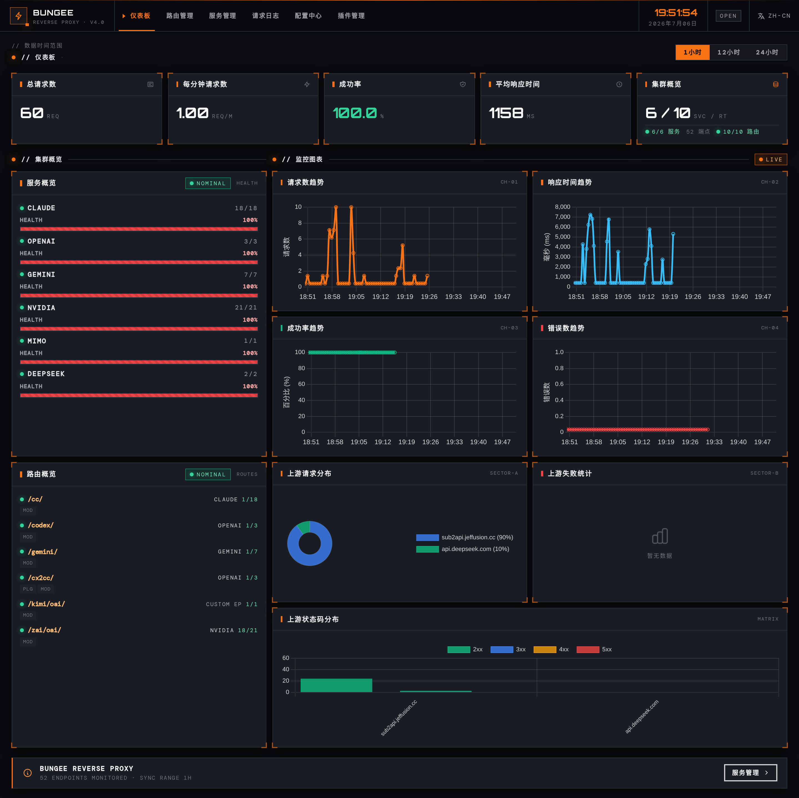

---

## 🌟 Overview

Bungee is a Bun + TypeScript reverse proxy designed for teams that want high throughput and programmable traffic control in the JS/TS ecosystem.
It combines hot configuration reloads, multi-process execution, plugin-based request/response transformations, and a built-in web dashboard.

### Why Bungee?

- **Developer-native**: Configure and extend gateway behavior in TypeScript-friendly workflows.
- **Production-ready**: Multi-worker architecture, structured logging, health checks, and failover support.
- **Extensible by design**: Plugin system for hooks, APIs, dashboard widgets, and AI provider format conversion.

---

## ✨ Feature Highlights

| Area | Highlights |
|---|---|
| **Runtime & Performance** | Bun runtime, multi-worker architecture, zero-downtime reload |
| **Traffic Control** | Route/upstream layering, load balancing, failover, health checks |
| **Transformation** | Expression engine, request/response mutation, streaming transform support |
| **Operations** | Web dashboard, CLI daemon management, structured logging, Docker support |
| **Extensibility** | Plugin hooks, plugin APIs, native dashboard widget integration |

For technical deep dives, use the docs index in the next section.

---

## 🖥️ Project Showcase

Bungee ships with a built-in **industrial dark dashboard** — a single control surface for routes, services, request logs, plugins, and runtime configuration. The UI runs on a strict industrial design system: hard edges, orange accent on a carbon/zinc palette, Orbitron numerics, corner brackets, no glassmorphism.

<details open>
<summary><b>Operations Dashboard</b></summary>


- Runtime KPIs: total requests, requests/min, success rate, average latency, cluster summary.
- Per-provider health bars (Claude / OpenAI / Gemini / NVIDIA / Mistral / DeepSeek) with route bindings underneath.
- Trend charts for request volume, latency, success rate, and errors over the active window.
- Upstream request distribution pie + status code distribution bar at the bottom.

</details>

<details>
<summary><b>Routes</b></summary>

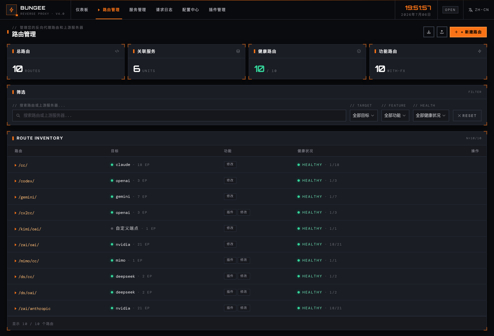

- KPI cards for total routes, mapped services, healthy routes, and routes with features toggled on.
- Industrial filter bar (BSelect / BDropdownAction) — filter by target type, feature set, health.
- Route inventory table with health status dot, feature badges, and one-click edit.

<details>
<summary>Route editor (multi-step builder)</summary>

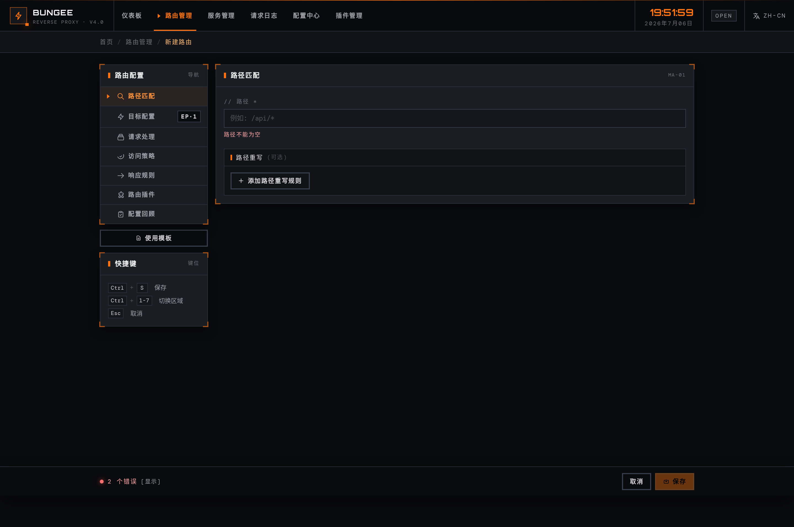

- Multi-step builder (path match → upstream → request handling) with sidebar navigation.
- Inline validation, keyboard shortcut palette, and live JSON preview at each step.

</details>

</details>

<details>
<summary><b>Services</b></summary>

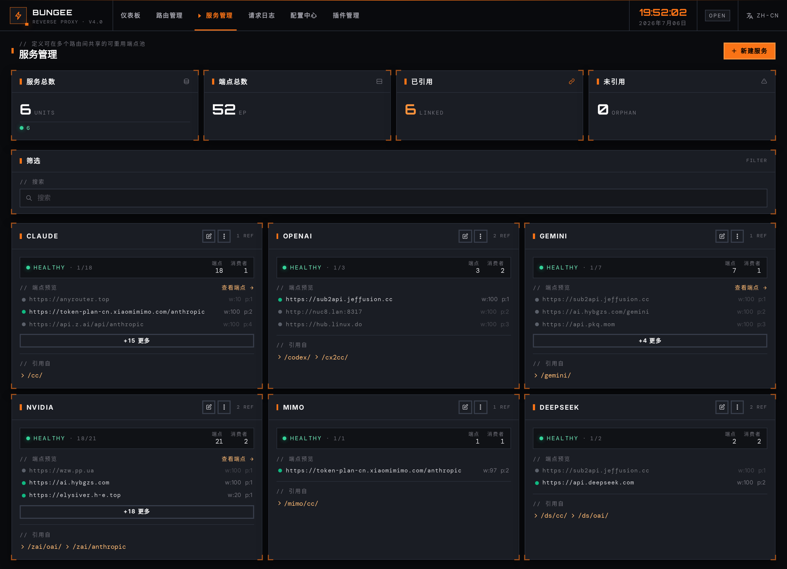

- KPI cards: service count, endpoint count, referenced, orphaned.
- Service cards with per-service health dot, endpoint preview, and reference counts.

<details>
<summary>Service editor (endpoint + healthcheck)</summary>

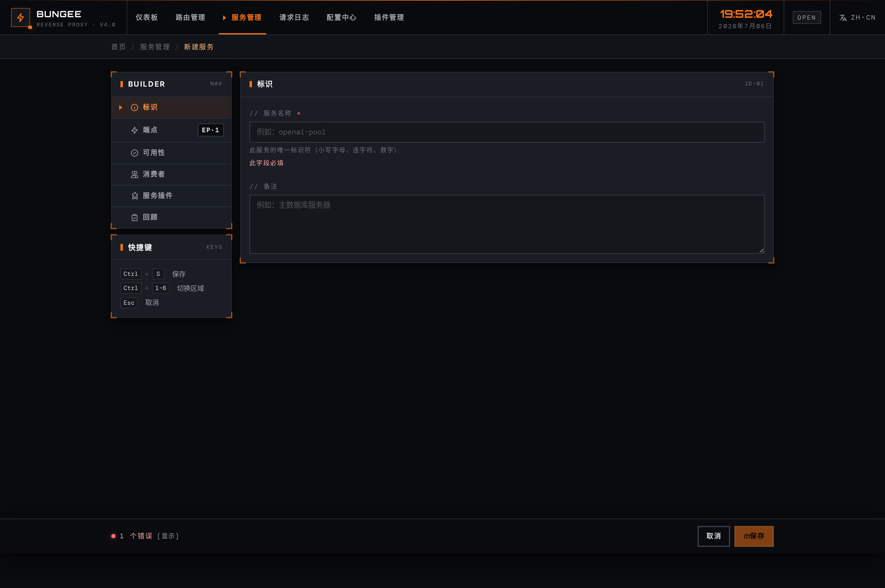

- Endpoint configuration, health check scheduling, failover tuning — all in industrial design language.

</details>

</details>

<details>
<summary><b>Request Logs</b></summary>

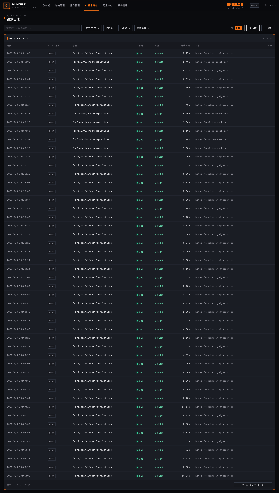

- Access log table with timestamp, HTTP method, path, status code, transform type, duration, upstream — at 50 rows/page.
- Multi-dimension filter bar (method / status / result / more), search by path, auto-refresh, manual refresh, and CSV export.
- Click any row to open the detail modal below.

<details>
<summary>Log Detail Modal — Protocol Conversion Inspector</summary>

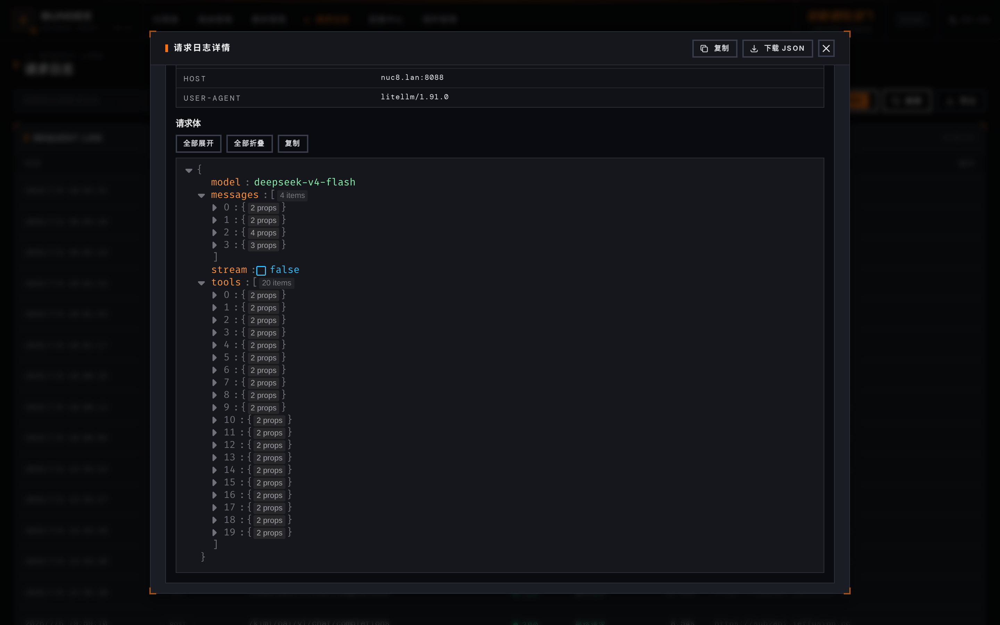

- SegmentedControl tabs: **原始请求 (Original) / 转换后 (Transformed) / 响应数据 (Response)**.
- Header grid in industrial KV layout — orange uppercase key labels, mono value cells, divided rows.
- JsonBodyViewer adapted to industrial dark theme — orange keys, green string literals, blue booleans, muted nulls, with collapsible nodes.

**Transformed request tab** — same request after AI provider protocol conversion:

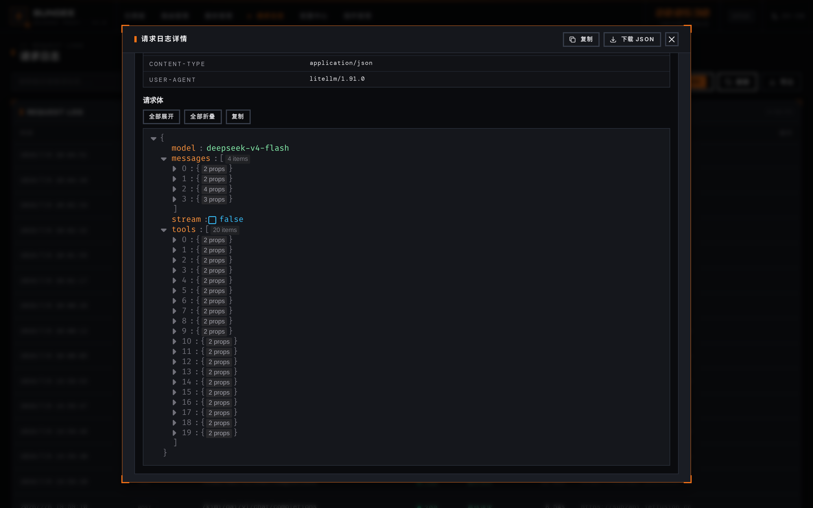

**Response data tab** — downstream provider's response, ready for the return trip:

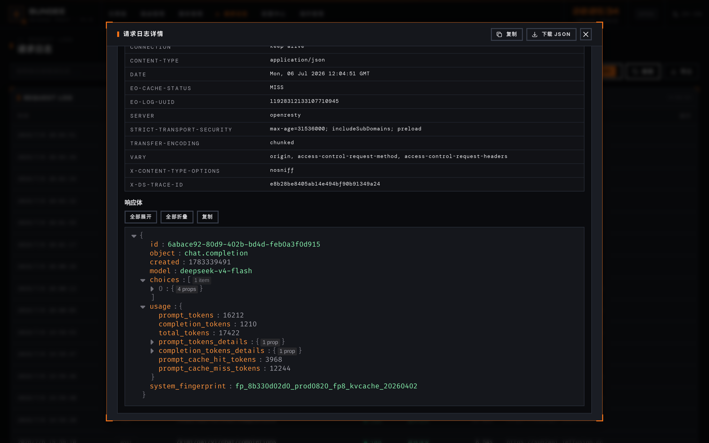

</details>

</details>

<details>
<summary><b>Configuration Center</b></summary>

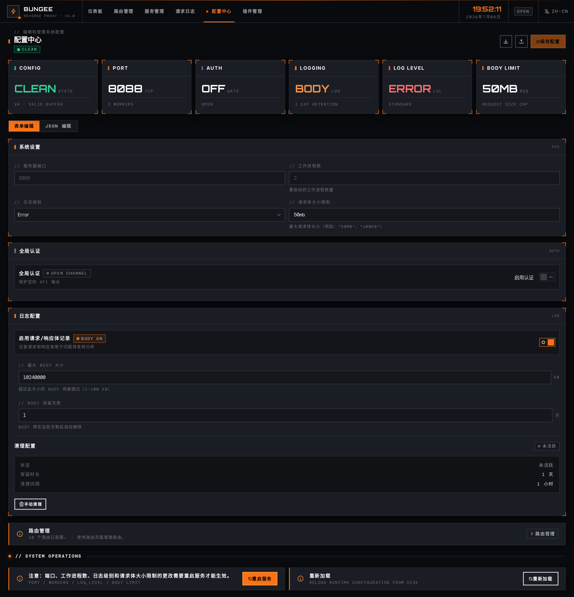

- System settings: port, worker count, log level, body size limit.
- Global auth toggle, body logging, max body size and retention days.
- Manual log cleanup and revisioned configuration editing from one panel.

</details>

<details>
<summary><b>Plugins</b></summary>

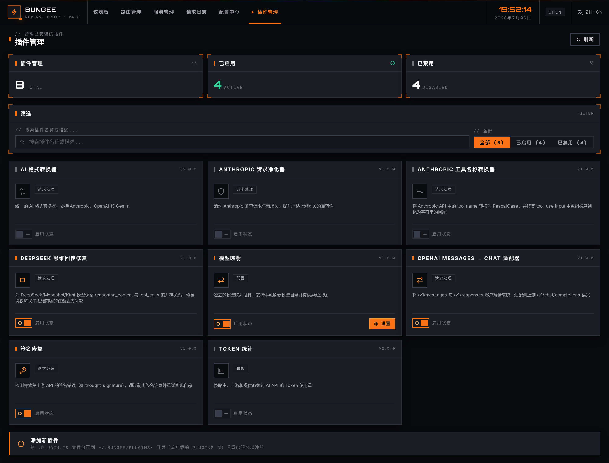

- Plugin inventory with version, description, and category badges.
- BSwitch toggle (default size, industrial hard-edge with orange ON / grey OFF) — confirm-before-toggling flow.
- Search by name, filter by enabled / disabled / all.

</details>

<details>
<summary><b>Industrial Design System (live reference)</b></summary>


- Carbon / Nexus / Zinc color tokens, Orbitron + DM Mono typography, spacing scale.
- Basic components (Button / Input / BSelect / Textarea / Switch / BSwitch).
- Industrial components (PanelCard / KpiCard / StatusDot / StatusBadge / MetricBar / BSegmentedControl / BDropdownAction / HudClock / CornerBrackets).
- Domain patterns (RouteFeatureBadges / HealthSummary / Toasts / PluginIcon).
- Live reference: `http://localhost:8088/__ui/#/design`.

</details>

---

## 📚 Documentation

Documentation index: [docs/README.md](docs/README.md)

### Start Here

- [Configuration Guide](docs/configuration.md)
- [Core Capabilities](docs/core-capabilities.md)
- [Architecture](docs/architecture.md)
- [Web Dashboard](docs/dashboard.md)
- [CLI Reference](docs/cli.md)
- [Deployment (Docker)](docs/deployment.md)
- [Development Guide](docs/development.md)

### Advanced Topics

- [Plugin System](docs/plugin-system.md)
- [Plugin Development](docs/plugin-development.md)
- [AI Provider Conversion](docs/ai-provider-conversion.md)

---

## 🚀 Quick Start

### Option 1: CLI (Recommended for Production)

```bash
# Initialize the SQLite data directory (~/.bungee/data)
npx bungee init

# Start daemon
npx bungee start

# Check status
npx bungee status
```

### Configuration model

CLI installations persist runtime configuration in `~/.bungee/data/bungee.db` and
access logs in `~/.bungee/logs/access.db`. `start` does not read a JSON config file.

Bungee uses a revisioned configuration aggregate:

- Reusable backend pools live under `services[].endpoints`
- Routes usually reference a service with `service`
- Config fields use snake_case, such as `body_parser_limit`, `path_rewrite`, and `retry_on`
- **Route** owns: path matching, auth, request processing (transformer, headers, body, `timeouts.request_ms`, rate_limit, cors)
- **Service** owns: endpoints, `load_balancing`, `health_check`, `failover`, `timeouts` (`connect_ms`/`send_ms`/`read_ms`)
- Configuration changes are CAS commits that produce a new revision and asynchronous publication operation
- Migrations use versioned `bungee export --file snapshot.json` / `bungee import --file snapshot.json` snapshots; legacy files are not loaded at runtime

See [Configuration Guide](docs/configuration.md) for the current schema.

### Option 2: Docker

```bash
docker-compose up -d
```

### Option 3: Development Mode

```bash
bun install
bun dev
```

Dashboard URL (default): `http://localhost:8088/__ui/`

---

## 🗺️ Roadmap

- [x] Web Dashboard
- [x] CLI Tool
- [x] Streaming Support
- [x] API Transformers
- [x] Plugin System
- [ ] WebSocket Proxying
- [ ] gRPC Proxying
- [ ] Automatic TLS/SSL
- [ ] Prometheus Metrics
- [ ] Rate Limiting

Have an idea? [Open an issue](https://github.com/jeffusion/bungee/issues/new/choose).

---

## 🤝 Contributing

Contributions are welcome.

- Follow [Conventional Commits](https://www.conventionalcommits.org/en/v1.0.0/)
- Open an issue before larger feature work
- Include tests for behavior changes

---

## 📄 License

MIT License. See [LICENSE](LICENSE).

---

<div align="center">
  <p>Made with ⚡ by the Bungee team</p>
  <p>
    <a href="https://github.com/jeffusion/bungee">GitHub</a> •
    <a href="https://github.com/jeffusion/bungee/issues">Issues</a> •
    <a href="https://github.com/jeffusion/bungee/discussions">Discussions</a>
  </p>
</div>
