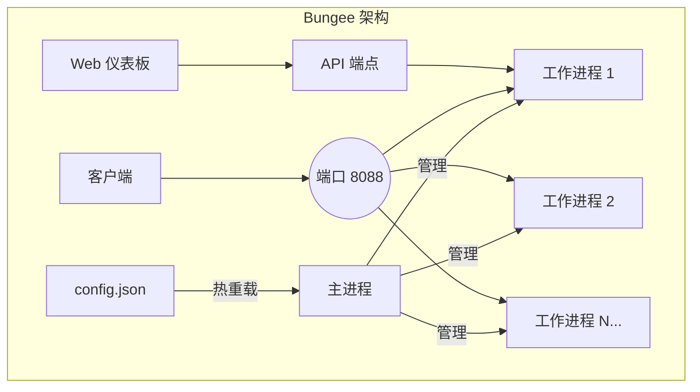

<div align="center">
  <pre>
    ____
   / __ )____  ____  __  __
  / __  / __ \/ __ \/ / / /
 / /_/ / /_/ / /_/ / /_/ /
/_____/\____/\____/\__,_/

  </pre>
  <h1>Bungee</h1>
  <p><strong>基于 Bun 运行时构建的高性能、可配置反向代理服务器。</strong></p>

  <p>
    <a href="https://github.com/jeffusion/bungee/actions/workflows/ci.yml">
      
    </a>
    <a href="https://github.com/jeffusion/bungee/releases">
      
    </a>
    <a href="https://github.com/jeffusion/bungee/blob/main/LICENSE">
      
    </a>
    <a href="https://github.com/jeffusion/bungee/stargazers">
      
    </a>
  </p>
</div>

**语言**: [English](README.md) | **中文**

---

## 🌟 概述

Bungee 是一个基于 Bun 和 TypeScript 构建的高性能、功能丰富的反向代理服务器。它将 Bun 运行时的极速性能与强大功能相结合，包括配置热重载、多进程架构、动态请求/响应转换，以及用于轻松管理的现代化 Web 仪表板。

### 为什么选择 Bungee？

在快速发展的 JavaScript 生态系统中，Bun 为速度和效率设定了新标准。Bungee 不仅提供了原生于这种高性能环境的反向代理解决方案，还拥抱了 TypeScript 的简洁性和强大功能来进行配置和管理。

与 Nginx 等传统反向代理不同，Bungee 允许你使用与应用程序相同的工具和语言来管理基础设施。它专为希望拥有快速、轻量级且可编程的网关，同时不离开 JS/TS 生态系统舒适区的开发者而设计。

---

## ✨ 功能特性

### 核心功能

| 功能 | 描述 |
|---|---|
| **🚀 高性能** | 基于 [Bun](https://bun.sh/) 构建，JavaScript 运行时中最快的之一，提供最大吞吐量和低延迟。 |
| **🎨 Web 仪表板** | 现代化、响应式的 Web UI，用于实时监控、路由管理和配置，带有可视化图表和指标。 |
| **⚙️ CLI 工具** | 独立的 CLI 工具，支持守护进程管理 - 无需 Bun 运行时，通过 npx 即可开箱即用。 |
| **🔄 零停机重载** | 修改 `config.json`，Bungee 执行优雅的滚动重启，无服务中断。 |
| **💾 自动配置备份** | 在更改之前自动备份配置文件，支持可配置的保留策略。 |
| **⚖️ 多进程架构** | 自动产生工作进程以利用所有 CPU 核心，通过操作系统级别的负载均衡。 |
| **🔧 动态配置** | 简单的基于 JSON 的配置，支持环境变量覆盖（环境变量 > config.json > 默认值）。 |
| **✅ TypeScript 优先** | 完全用 TypeScript 编写，提供更好的可维护性和类型安全。 |

### 高级能力

| 功能 | 描述 |
|---|---|
| **🧪 动态表达式引擎** | 强大的表达式引擎，内置 40+ 函数，使用 `{{ }}` 语法进行动态请求/响应转换。 |
| **🔀 API 格式转换** | 内置转换器，实现无缝 API 兼容性（如 `anthropic-to-gemini`、`openai-to-anthropic`）。 |
| **🌊 流式响应支持** | 先进的流式转换架构，具有状态机模式，实现实时 API 格式转换。 |
| **🎯 配置驱动** | 框架不包含任何硬编码的 API 格式知识 - 所有流式行为均由转换器配置控制。 |
| **⚡ 分层规则处理** | 洋葱模型规则执行，包含路由、上游和转换器层，提供最大灵活性。 |
| **✍️ 请求头和正文修改** | 为任何路由或上游动态添加、删除或设置请求头和 JSON 正文的默认字段。 |
| **🔗 故障转移和健康检查** | 自动检测不健康的上游并将流量重新路由到健康的上游，支持基于优先级的故障转移。 |
| **🎯 负载均衡** | 基于权重和优先级的负载均衡，支持同一优先级的多个上游。 |

### DevOps 和生产

| 功能 | 描述 |
|---|---|
| **📜 结构化日志** | 使用 [Winston](https://github.com/winstonjs/winston) 的生产就绪结构化日志，支持按日期轮转、基于大小的轮转和自动清理。 |
| **🐳 Docker 就绪** | 多阶段 Dockerfile 和 docker-compose.yml，便于容器化部署，带有健康检查。 |
| **🤖 自动化发布** | 集成 semantic-release，实现完全自动化的版本控制、变更日志生成和 npm 发布。 |
| **🔄 系统重启 API** | Web UI 和 API 端点支持在配置更改需要时进行优雅的系统重启。 |
| **🔍 实时监控** | 实时统计数据仪表板，包含请求计数、响应时间、错误率和上游健康状态。 |

---

## 🎯 核心能力

### 🧪 动态表达式引擎

使用强大的表达式系统转换请求和响应：

```json
{
  "headers": {
    "add": {
      "Authorization": "Bearer {{ crypto.randomUUID() }}",
      "X-User-ID": "{{ body.user?.id || 'anonymous' }}",
      "X-Timestamp": "{{ Date.now() }}"
    }
  },
  "body": {
    "add": {
      "processed_at": "{{ new Date().toISOString() }}",
      "client_ip": "{{ headers['x-forwarded-for'] || 'unknown' }}"
    }
  }
}
```

**上下文变量：**

- `headers`：请求头对象
- `body`：解析的请求正文
- `url`：URL 组件（pathname、search、host、protocol）
- `method`：HTTP 方法
- `env`：环境变量
- `stream`：流式上下文 - **仅在流式规则中可用**
  - `stream.phase`：当前阶段（'start' | 'chunk' | 'end'）
  - `stream.chunkIndex`：当前数据块索引（从 0 开始）

**内置函数（40+）：**

- **加密**：`uuid()`、`randomInt()`、`sha256()`、`md5()`
- **字符串**：`base64encode()`、`base64decode()`、`trim()`、`split()`
- **JSON**：`jsonParse()`、`jsonStringify()`、`parseJWT()`
- **数组**：`first()`、`last()`、`length()`、`keys()`、`values()`
- **工具**：`deepClean()`、`isString()`、`isArray()`、`now()`

### 🔀 API 格式转换

无缝转换不同的 API 格式：

```json
{
  "transformer": "anthropic-to-gemini",
  "upstreams": [
    {
      "target": "https://gemini-api.googleapis.com",
      "headers": { "add": { "Authorization": "Bearer YOUR_GEMINI_KEY" } }
    }
  ]
}
```

**内置转换器：**

- `openai-to-anthropic`：将 OpenAI 聊天格式转换为 Claude API
  - 使用 `eventTypeMapping` 处理 Anthropic SSE 事件类型
  - 正确处理 finish_reason（null → "stop"/"length"）
  - 支持带有正确 delta 字段的流式传输

- `anthropic-to-gemini`：将 Claude API 调用转换为 Google Gemini 格式
  - 使用 `phaseDetection` 处理 Gemini 流式传输（无 `event:` 字段）
  - 多事件结束阶段（message_delta + message_stop）
  - 支持工具调用和思考模式

### 🌊 流式响应支持

**配置驱动架构** - 完全可配置的流式处理，无硬编码的 API 格式知识：

#### 事件类型映射

将 SSE 事件类型映射到阶段（适用于带 `event:` 字段的 API，如 Anthropic）：

```json
{
  "stream": {
    "eventTypeMapping": {
      "message_start": "start",
      "content_block_delta": "chunk",
      "message_delta": "end",
      "message_stop": "skip"
    }
  }
}
```

#### 阶段检测

基于表达式的阶段检测（适用于不带 `event:` 字段的 API，如 Gemini）：

```json
{
  "stream": {
    "phaseDetection": {
      "isEnd": "{{ body.candidates && body.candidates[0].finishReason }}"
    }
  }
}
```

#### 三层优先级系统

1. **eventTypeMapping**：用于基于事件的 SSE（Anthropic 格式）
2. **phaseDetection**：用于基于内容的 SSE（Gemini 格式）
3. **顺序回退**：向后兼容（无配置）

#### 关键特性

- ✅ **忠实的数据处理**：无强制类型转换 - 表达式返回精确的求值结果
- ✅ **多事件支持**：使用 `__multi_events` 从单个输入事件生成多个 SSE 事件
- ✅ **状态机**：支持带有上下文感知转换的 start/chunk/end 阶段
- ✅ **传输层**：处理 SSE 解析、数据块管理和正确的事件边界

### ⚡ 分层规则处理（洋葱模型）

规则分层处理，实现最大灵活性：

1. **路由层**：路径下所有请求的基础规则
2. **上游层**：选定上游的特定规则
3. **转换器层**：API 格式转换规则

每一层都可以覆盖或扩展前一层的规则。

---

## 🚀 快速开始

### 方式 1：CLI 工具（推荐用于生产）

Bungee 可以直接通过 npx 使用，无需安装 Bun 运行时：

```bash
# 初始化配置（创建 ~/.bungee/config.json）
npx bungee init

# 启动守护进程
npx bungee start

# 检查状态
npx bungee status

# 查看日志
npx bungee logs -f

# 停止守护进程
npx bungee stop
```

### 方式 2：Docker

```bash
# 使用 docker-compose（推荐）
docker-compose up -d

# 或直接使用 Docker
docker run -d \
  --name bungee \
  -p 8088:8088 \
  -v $(pwd)/config.json:/usr/src/app/config.json:ro \
  -v $(pwd)/logs:/usr/src/app/logs \
  --env-file .env \
  bungee
```

### 方式 3：开发模式

用于开发和贡献：

```bash
# 首先安装 Bun（https://bun.sh）
curl -fsSL https://bun.sh/install | bash

# 克隆仓库
git clone https://github.com/jeffusion/bungee.git
cd bungee

# 启动开发服务器（带热重载）
bun dev

# 或以生产模式启动
bun start
```

---

## 🎨 Web 仪表板

Bungee 包含一个现代化、响应式的 Web 仪表板，可通过 `http://localhost:8088/__ui/`（或你配置的端口）访问。

### 仪表板功能

- **📊 实时监控**：实时请求统计、响应时间和错误率，带可视化图表
- **🗺️ 路由管理**：
  - 查看所有已配置的路由及其上游详情
  - 通过直观的表单添加、编辑和删除路由
  - 路由健康和状态的可视化指示器
  - 支持路径重写、转换器和负载均衡配置
- **⚙️ 配置管理**：
  - 编辑全局设置（日志级别、工作进程数、端口、请求体解析限制）
  - 应用更改并自动验证
  - 需要时直接从 UI 重启系统
  - 实时配置验证反馈
- **💡 用户友好界面**：
  - 使用 Svelte 和 DaisyUI 构建
  - 响应式设计，适配桌面和移动设备
  - 支持暗色模式
  - 所有操作都有 Toast 通知

### 访问仪表板

启动 Bungee 后，在浏览器中打开：

```text
http://localhost:8088/__ui/
```

仪表板在保留路径 `/__ui/` 上提供服务，不会与你的代理路由冲突。

---

## 📖 配置

### 配置优先级

Bungee 支持三层配置优先级系统：

```text
环境变量 > config.json > 默认值
```

### 全局设置

通过 Web UI 或 `config.json` 编辑：

```json
{
  "logLevel": "info",           // 日志级别：trace、debug、info、warn、error
  "workers": 2,                 // 工作进程数量
  "port": 8088,                 // 服务器端口
  "bodyParserLimit": "50mb",    // 最大请求体大小
  "routes": [...]               // 路由配置
}
```

### 环境变量

创建 `.env` 文件或设置环境变量：

```env
LOG_LEVEL=debug
WORKER_COUNT=4
PORT=3000
BODY_PARSER_LIMIT=100mb
```

### 路由配置

每个路由定义：

- `path`：匹配的 URL 路径前缀
- `pathRewrite`：（可选）用于重写路径的正则表达式模式
- `upstreams`：上游服务器数组
- `headers`、`body`：（可选）路由级修改规则
- `transformer`：（可选）内置转换器名称
- `failover`、`healthCheck`：（可选）高可用性配置

### 上游配置

每个上游定义：

- `target`：上游服务的 URL
- `weight`：（可选）负载均衡的流量比例
- `priority`：（可选）较低值 = 故障转移时的较高优先级
- `transformer`：（可选）上游特定的转换器
- `headers`、`body`：（可选）上游级规则

### 配置示例

```json
{
  "logLevel": "info",
  "workers": 2,
  "port": 8088,
  "bodyParserLimit": "50mb",
  "routes": [
    {
      "path": "/api/claude",
      "transformer": "anthropic-to-gemini",
      "headers": {
        "add": {
          "X-Request-ID": "{{ crypto.randomUUID() }}"
        }
      },
      "upstreams": [
        {
          "target": "https://generativelanguage.googleapis.com",
          "weight": 80,
          "priority": 1,
          "headers": {
            "add": {
              "Authorization": "Bearer {{ env.GEMINI_API_KEY }}"
            }
          }
        },
        {
          "target": "https://backup-api.example.com",
          "weight": 20,
          "priority": 2
        }
      ],
      "healthCheck": {
        "enabled": true,
        "interval": 30000,
        "timeout": 5000,
        "path": "/health"
      },
      "failover": {
        "enabled": true,
        "retryableStatusCodes": [500, 502, 503, 504]
      }
    }
  ]
}
```

详细配置选项请参见[配置指南](docs/configuration.md)。

---

## 🏗️ 架构

Bungee 采用主-工作进程模型，确保高可用性和有效的资源利用。



### 组件

- **主进程**：
  - 监控 `config.json` 的变化
  - 管理工作进程的生命周期
  - 处理优雅关闭和滚动重启
  - 本身不直接处理网络流量

- **工作进程**：
  - 工作进程池（默认：2，可配置）
  - 全部监听同一端口
  - 操作系统处理工作进程间的负载均衡
  - 每个工作进程同时服务代理流量和 API/UI 端点

- **零停机重载**：
  - 主进程检测 `config.json` 变化
  - 执行滚动重启：启动新工作进程，然后优雅地停止旧进程
  - 重载期间无连接中断

### 架构原则

Bungee 遵循 SOLID 原则和整洁架构模式：

- **🎯 关注点分离**：框架提供能力，转换器提供业务逻辑
- **🔧 配置驱动**：所有 API 格式知识都存在于转换器配置中，而不是框架代码中
- **✨ 忠实处理**：表达式引擎返回精确的求值结果，不进行强制类型转换
- **🔓 开闭原则**：对扩展开放（通过配置），对修改封闭（框架核心）
- **📦 分层架构**：传输层、业务层和配置层之间明确分离

---

## 📦 CLI 参考

### 命令

| 命令 | 描述 |
|------|------|
| `bungee init [path]` | 初始化配置文件（默认：`~/.bungee/config.json`） |
| `bungee start [config]` | 启动代理服务器守护进程 |
| `bungee stop` | 停止代理服务器守护进程 |
| `bungee restart [config]` | 重启代理服务器守护进程 |
| `bungee status` | 显示守护进程状态和健康信息 |
| `bungee logs [options]` | 显示守护进程日志 |

### 选项

**启动/重启：**

- `-p, --port <port>`：覆盖默认端口
- `-w, --workers <count>`：工作进程数量（默认：2）

**初始化：**

- `-f, --force`：覆盖现有配置文件

**日志：**

- `-f, --follow`：跟踪日志输出（类似 `tail -f`）
- `-n, --lines <number>`：显示的行数（默认：50）

### 数据目录

默认位置：`~/.bungee/`

```text
~/.bungee/
├── config.json        # 配置文件
├── bungee.pid         # 进程 ID 文件
├── bungee.log         # 标准输出日志
└── bungee.error.log   # 错误日志
```

---

## 🐳 Docker 部署

### 前置要求

- 安装 [Docker](https://docs.docker.com/get-docker/)
- 安装 [Docker Compose](https://docs.docker.com/compose/install/)（可选，推荐）

### 环境配置

1. 从示例创建 `.env` 文件：

```bash
cp .env.example .env
```

2. 配置你的环境变量：

```env
WORKER_COUNT=2
PORT=8088
LOG_LEVEL=info
BODY_PARSER_LIMIT=50mb
```

### 使用 Docker Compose（推荐）

```bash
# 启动服务
docker-compose up -d

# 查看日志
docker-compose logs -f bungee

# 停止服务
docker-compose down

# 重新构建并重启
docker-compose up -d --build
```

### 直接使用 Docker

```bash
# 构建镜像
docker build -t bungee .

# 运行容器
docker run -d \
  --name bungee \
  -p 8088:8088 \
  -v $(pwd)/config.json:/usr/src/app/config.json:ro \
  -v $(pwd)/logs:/usr/src/app/logs \
  --env-file .env \
  bungee
```

### 健康检查

容器包含内置健康检查：

```bash
# 检查容器健康状态
docker ps

# 手动健康检查
curl http://localhost:8088/health
```

### 生产注意事项

- **日志**：持久化到主机上的 `./logs` 目录
- **配置**：以只读方式挂载以确保安全
- **环境**：使用 `.env` 文件进行配置管理
- **重启策略**：容器在明确停止之前自动重启
- **安全**：在容器内以非 root 用户运行
- **监控**：可选的 Watchtower 集成用于自动更新

---

## 🛠️ 开发

### 前置要求

- [Bun](https://bun.sh/docs/installation) v1.0.0 或更高版本

### 项目结构

```text
.
├── packages/
│   ├── core/              # 核心反向代理引擎
│   │   ├── src/
│   │   │   ├── main.ts           # 应用程序入口点
│   │   │   ├── master.ts         # 主进程
│   │   │   ├── worker.ts         # 工作进程
│   │   │   ├── config.ts         # 配置管理
│   │   │   ├── logger.ts         # 日志设置
│   │   │   ├── expression-engine.ts  # 动态表达式
│   │   │   ├── streaming.ts      # 流式引擎
│   │   │   └── transformers.ts   # API 转换器
│   │   └── tests/                # 核心测试
│   ├── cli/               # CLI 工具
│   │   └── src/
│   │       └── daemon/           # 守护进程管理
│   ├── shared/            # 共享类型和工具
│   └── ui/                # Web 仪表板
│       └── src/
│           ├── routes/           # 仪表板页面
│           ├── lib/              # UI 组件
│           └── App.svelte        # 主应用组件
├── scripts/               # 构建和发布脚本
├── config.json           # 配置文件
├── docker-compose.yml    # Docker 编排
└── README.md             # 本文件
```

### 开发工作流

```bash
# 安装依赖（Bun 自动处理）
bun install

# 运行开发服务器（带热重载）
bun dev

# 运行测试
bun test

# 构建所有包
bun run build

# 构建 UI 和核心
bun run build:ui
bun run build:core

# 构建独立二进制文件
bun run build:binaries
```

### 运行测试

```bash
# 运行所有测试
bun test

# 运行特定测试文件
bun test tests/transformer.test.ts

# 带覆盖率运行
bun test --coverage
```

---

## 🗺️ 路线图

- [x] **Web 仪表板**：实时监控和配置管理 ✅
- [x] **CLI 工具**：独立守护进程管理 ✅
- [x] **流式响应支持**：高级流式转换 ✅
- [x] **API 转换器**：格式转换系统 ✅
- [ ] **WebSocket 代理**：完全支持代理 WebSocket 连接
- [ ] **gRPC 代理**：支持 gRPC 服务
- [ ] **插件系统**：可扩展的插件系统，用于自定义逻辑和中间件
- [ ] **自动 TLS/SSL**：与 Let's Encrypt 集成，实现自动证书管理
- [ ] **Prometheus 指标**：用于监控的原生指标导出
- [ ] **速率限制**：内置速率限制和流量控制

有想法吗？欢迎 [提交问题](https://github.com/jeffusion/bungee/issues/new/choose) 来建议功能！

---

## 🤝 贡献

欢迎贡献！请遵循以下指南：

- **提交信息**：此项目遵循 [约定式提交](https://www.conventionalcommits.org/zh-hans/v1.0.0/) 规范。提交信息在提交时会自动检查。
- **问题**：在开始新功能或错误修复工作之前，请先打开一个问题。
- **拉取请求**：提交拉取请求并清楚描述你的更改。
- **测试**：为新功能添加测试并确保所有测试通过。

---

## 📄 许可证

此项目基于 MIT 许可证。详细信息请参见 [LICENSE](LICENSE) 文件。

---

<div align="center">
  <p>使用 ⚡ 由 Bungee 团队制作</p>
  <p>
    <a href="https://github.com/jeffusion/bungee">GitHub</a> •
    <a href="https://github.com/jeffusion/bungee/issues">问题</a> •
    <a href="https://github.com/jeffusion/bungee/discussions">讨论</a>
  </p>
</div>