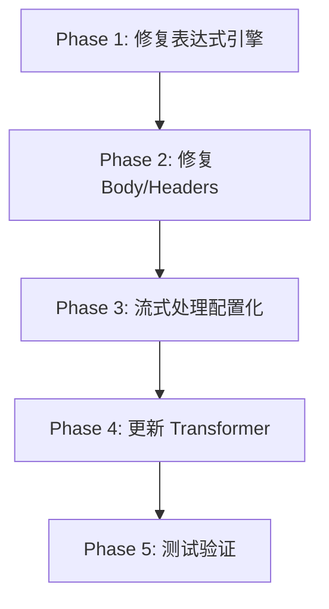

# Bungee 架构重构方案

**日期**: 2025-01-12
**状态**: 待实施
**优先级**: 高（架构问题）

## 执行摘要

当前 Bungee 框架存在**业务逻辑与框架核心耦合**的架构问题。本文档提出完整的解耦方案，将业务逻辑完全移至 transformer 配置层，使框架核心保持通用性。

---

## 问题分析

### 1. 核心问题：业务逻辑侵入框架

#### 问题 1.1: `worker.ts` 中的不必要清理逻辑

**位置**: `packages/core/src/worker.ts:296-315`

```typescript
// ❌ 当前代码
function removeEmptyFields(obj: any): any {
    if (obj === null || obj === undefined) {
        return undefined;  // 清理 null
    }
    // ... 清理空字符串、空对象
}
```

**问题**:
- Transformer 明确配置了 `finish_reason: null`，但被清理掉
- Transformer 明确配置了 `delta: {}`，但被清理掉
- 框架不应该"猜测"什么值是"无效"的

#### 问题 1.2: `expression-engine.ts` 中的错误类型转换

**位置**: `packages/core/src/expression-engine.ts:182-184`

```typescript
// ❌ 当前代码
if (typeof result === 'undefined' || result === null) {
  return '';  // 强制转换为空字符串
}
```

**问题**:
- 表达式求值 `undefined` 被转换为 `''`
- 导致需要额外的清理逻辑
- 混淆了 Headers（必须字符串）和 Body（任意 JSON）的需求

#### 问题 1.3: `streaming.ts` 中的硬编码事件类型

**位置**: `packages/core/src/streaming.ts:122-129`

```typescript
// ❌ 当前代码
if (eventType === 'message_start') {
    phase = 'start';
} else if (eventType === 'content_block_delta') {
    phase = 'chunk';
} else if (eventType === 'message_delta') {
    phase = 'end';
}
```

**问题**:
- 框架不应该知道 Anthropic 的事件类型
- 新增 API 格式需要修改框架代码
- 违反开闭原则

### 2. 架构对比

#### 当前架构（错误）

```
┌─────────────────────────────────────┐
│  Framework Core                     │
│  (worker.ts, streaming.ts)          │
│                                     │
│  Contains:                          │
│  - OpenAI format knowledge   ❌     │
│  - Anthropic event types     ❌     │
│  - Cleanup business logic    ❌     │
└─────────────────────────────────────┘
           ↓ uses
┌─────────────────────────────────────┐
│  Transformer Config                 │
│  (Pure configuration)               │
└─────────────────────────────────────┘
```

#### 目标架构（正确）

```
┌─────────────────────────────────────┐
│  Transformer Config                 │
│  (Configuration + Business Logic)   │
│                                     │
│  Contains:                          │
│  - Event type mapping        ✅     │
│  - Field preservation rules  ✅     │
│  - Format-specific logic     ✅     │
└─────────────────────────────────────┘
           ↓ uses
┌─────────────────────────────────────┐
│  Framework Core                     │
│  (worker.ts, streaming.ts)          │
│                                     │
│  Provides:                          │
│  - Expression evaluation     ✅     │
│  - Rule application          ✅     │
│  - SSE parsing               ✅     │
│  - Generic capabilities      ✅     │
└─────────────────────────────────────┘
```

---

## 解决方案

### Phase 1: 修复表达式引擎

**目标**: 表达式引擎忠实返回求值结果，不做类型转换

#### 1.1 修改 `evaluateExpression`

**文件**: `packages/core/src/expression-engine.ts`

```typescript
// ✅ 修改后
export function evaluateExpression(expression: string, context: ExpressionContext): any {
  try {
    const evaluator = new SafeEvaluator(context);
    return evaluator.evaluate(expression);  // 忠实返回，不转换
  } catch (error) {
    if (!isTestEnvironment) {
      logger.error({ expression, error }, 'Failed to evaluate expression');
    }
    throw error;
  }
}
```

**变更说明**:
- 删除 lines 182-184 的类型转换逻辑
- 直接返回求值结果（包括 `null`, `undefined`, `{}`, `[]` 等）

---

### Phase 2: 修复 Body/Headers 处理逻辑

**目标**: 在使用层面处理类型要求，而非在表达式引擎层面

#### 2.1 修改 `applyBodyRules`

**文件**: `packages/core/src/worker.ts`

```typescript
// ✅ 修改后
export async function applyBodyRules(
  body: Record<string, any>,
  rules: ModificationRules['body'],
  context: ExpressionContext,
  requestLog: any
): Promise<Record<string, any>> {
  let modifiedBody = { ...body };

  const processAndSet = (key: string, value: any, action: 'add' | 'replace') => {
    try {
      const processedValue = processDynamicValue(value, context);

      // 只排除 undefined（JSON 不支持），保留其他所有值
      if (processedValue !== undefined) {
        modifiedBody[key] = processedValue;
        logger.debug(
          { request: requestLog, body: { key, value: processedValue } },
          `Applied body '${action}' rule`
        );
      } else {
        logger.debug(
          { request: requestLog, body: { key } },
          `Skipped body '${action}' rule (undefined result)`
        );
      }
    } catch (err) {
      logger.error(
        { request: requestLog, body: { key }, err },
        `Failed to process body '${action}' rule`
      );
    }
  };

  // Add rules
  if (rules.add) {
    forEach(rules.add, (value, key) => processAndSet(key, value, 'add'));
  }

  // Replace rules
  if (rules.replace) {
    forEach(rules.replace, (value, key) => {
      if (key in modifiedBody || (rules.add && key in rules.add)) {
        processAndSet(key, value, 'replace');
      }
    });
  }

  // Remove rules
  if (rules.remove) {
    for (const key of rules.remove) {
      const wasAdded = rules.add && key in rules.add;
      const wasReplaced = rules.replace && key in rules.replace;
      if (!wasAdded && !wasReplaced) {
        delete modifiedBody[key];
        logger.debug({ request: requestLog, body: { key } }, 'Removed body field');
      }
    }
  }

  // ✅ 不需要任何清理逻辑！

  // 处理多事件
  if (modifiedBody.__multi_events && Array.isArray(modifiedBody.__multi_events)) {
    logger.debug(
      { request: requestLog, eventCount: modifiedBody.__multi_events.length },
      "Returning multiple events"
    );
    return modifiedBody.__multi_events;
  }

  logger.debug(
    { request: requestLog, phase: 'after', body: modifiedBody },
    "Body after applying rules"
  );
  return modifiedBody;
}
```

**变更说明**:
- 删除 line 369 的 `removeEmptyFields` 调用
- 在 `processAndSet` 中只排除 `undefined`
- 保留所有其他值，包括 `null`, `{}`, `[]`, `''`

#### 2.2 删除 `removeEmptyFields` 函数

**文件**: `packages/core/src/worker.ts`

```typescript
// ❌ 完全删除 lines 296-315
// function removeEmptyFields(obj: any): any { ... }
```

#### 2.3 修改 Headers 处理

**文件**: `packages/core/src/worker.ts`

找到 `applyHeaderRules` 函数，确保在使用时转换为字符串：

```typescript
// ✅ 修改后
if (rules?.add) {
  forEach(rules.add, (value, key) => {
    try {
      const processedValue = processDynamicValue(value, context);

      // Headers 必须是字符串，在这里转换
      const headerValue = String(processedValue ?? '');
      modifiedHeaders.set(key, headerValue);

      logger.debug(
        { request: requestLog, headers: { key, value: headerValue } },
        "Applied header 'add' rule"
      );
    } catch (err) {
      logger.error(
        { request: requestLog, headers: { key }, err },
        "Header add expression failed"
      );
    }
  });
}
```

---

### Phase 3: 流式处理配置化

**目标**: 将 SSE 事件类型映射逻辑从框架移至配置

#### 3.1 扩展类型定义

**文件**: `packages/shared/src/config.ts`

```typescript
/**
 * SSE 事件类型映射（用于带 event: 字段的 SSE）
 *
 * @example
 * // Anthropic SSE 格式
 * {
 *   'message_start': 'start',
 *   'content_block_delta': 'chunk',
 *   'message_delta': 'end',
 *   'message_stop': 'skip',
 *   'ping': 'skip'
 * }
 */
export interface EventTypeMapping {
  [eventType: string]: 'start' | 'chunk' | 'end' | 'skip';
}

/**
 * 流阶段检测（用于基于 body 内容判断，适用于不带 event: 的 SSE）
 *
 * @example
 * // Gemini SSE 格式
 * {
 *   isEnd: '{{ body.candidates && body.candidates[0].finishReason }}'
 * }
 */
export interface PhaseDetection {
  isStart?: string;   // 表达式，返回 boolean
  isChunk?: string;   // 表达式，返回 boolean
  isEnd?: string;     // 表达式，返回 boolean
}

/**
 * 流转换规则（扩展）
 */
export interface StreamTransformRules {
  /**
   * 事件类型映射（适用于 Anthropic 等带 event: 的 SSE）
   *
   * 当 SSE 事件包含 "event: xxx" 行时，使用此映射决定如何处理
   */
  eventTypeMapping?: EventTypeMapping;

  /**
   * 阶段检测表达式（适用于 Gemini 等不带 event: 的 SSE）
   *
   * 当 SSE 事件不包含 event: 行时，使用表达式检测事件类型
   */
  phaseDetection?: PhaseDetection;

  /**
   * 开始阶段转换规则
   */
  start?: ModificationRules;

  /**
   * 数据块阶段转换规则
   */
  chunk?: ModificationRules;

  /**
   * 结束阶段转换规则
   */
  end?: ModificationRules;
}
```

#### 3.2 修改 `streaming.ts`

**文件**: `packages/core/src/streaming.ts`

```typescript
// ✅ 新增函数：确定事件阶段
function determinePhase(
  eventType: string | null,
  parsedBody: any,
  streamRules: StreamTransformRules | null,
  hasStarted: boolean,
  requestContext: ExpressionContext,
  requestLog: any
): 'start' | 'chunk' | 'end' | 'skip' {

  // 方式1：如果有 SSE event type，使用 eventTypeMapping
  if (eventType && streamRules?.eventTypeMapping) {
    const mappedPhase = streamRules.eventTypeMapping[eventType];
    if (mappedPhase) {
      logger.debug(
        { request: requestLog, eventType, mappedPhase },
        "Determined phase via eventTypeMapping"
      );
      return mappedPhase;
    }
  }

  // 方式2：如果配置了 phaseDetection，使用表达式检测
  if (streamRules?.phaseDetection) {
    const { isStart, isChunk, isEnd } = streamRules.phaseDetection;
    const eventContext = { ...requestContext, body: parsedBody };

    try {
      // 按优先级检测：end > start > chunk
      if (isEnd) {
        const result = evaluateExpression(isEnd, eventContext);
        if (result) {
          logger.debug(
            { request: requestLog, expression: isEnd },
            "Determined phase as 'end' via phaseDetection"
          );
          return 'end';
        }
      }

      if (isStart) {
        const result = evaluateExpression(isStart, eventContext);
        if (result) {
          logger.debug(
            { request: requestLog, expression: isStart },
            "Determined phase as 'start' via phaseDetection"
          );
          return 'start';
        }
      }

      if (isChunk) {
        const result = evaluateExpression(isChunk, eventContext);
        if (result) {
          logger.debug(
            { request: requestLog, expression: isChunk },
            "Determined phase as 'chunk' via phaseDetection"
          );
          return 'chunk';
        }
      }
    } catch (error) {
      logger.error(
        { request: requestLog, error },
        'Phase detection expression evaluation failed'
      );
    }
  }

  // 方式3：回退到顺序处理（向后兼容）
  if (!hasStarted) {
    logger.debug(
      { request: requestLog },
      "Determined phase as 'start' (fallback: first event)"
    );
    return 'start';
  }

  // 默认为 chunk
  logger.debug(
    { request: requestLog },
    "Determined phase as 'chunk' (fallback: default)"
  );
  return 'chunk';
}
```

然后在 `transform` 函数中使用：

```typescript
// ✅ 替换原有的硬编码逻辑 (lines 118-151)
if (eventType) {
  // 使用配置化的阶段判断
  const phase = determinePhase(
    eventType,
    parsedBody,
    streamRules,
    state.hasStarted,
    requestContext,
    requestLog
  );

  logger.debug({
    request: requestLog,
    parsedBody,
    eventType,
    phase,
    hasStarted: state.hasStarted
  }, "Processing streaming event with event type");

  // 根据阶段处理
  if (phase === 'start' && !state.hasStarted && streamRules?.start) {
    await sendEvent(controller, parsedBody, 'start');
    state.hasStarted = true;
  } else if (phase === 'chunk' && (streamRules?.chunk || legacyRules)) {
    await sendEvent(controller, parsedBody, 'chunk');
    state.chunkCount++;
  } else if (phase === 'end' && streamRules?.end) {
    await sendEvent(controller, parsedBody, 'end');
    state.isFinished = true;
  }
  // phase === 'skip' - do nothing

} else {
  // 无 event type，使用配置化的阶段判断
  const phase = determinePhase(
    null,
    parsedBody,
    streamRules,
    state.hasStarted,
    requestContext,
    requestLog
  );

  // ... 相同的处理逻辑
}
```

#### 3.3 删除硬编码的 `isLastChunk`

**文件**: `packages/core/src/streaming.ts`

```typescript
// ❌ 删除 lines 224-247
// function isLastChunk(data: any): boolean {
//   if (data.type === 'message_stop' || data.type === 'message_delta') { ... }
//   if (data.candidates?.[0]?.finishReason) { ... }
//   if (data.choices?.[0]?.finish_reason) { ... }
//   ...
// }
```

**说明**: 这个函数包含业务逻辑（识别特定 API 格式），应该被配置化的 `phaseDetection` 替代。

---

### Phase 4: 更新 Transformer 配置

#### 4.1 更新 `openai-to-anthropic`

**文件**: `packages/core/src/transformers.ts`

```typescript
'openai-to-anthropic': [
  {
    path: {
      action: 'replace',
      match: '^/v1/chat/completions$',
      replace: '/v1/messages',
    },
    request: {
      body: {
        add: {
          system: '{{ body.messages.filter(m => m.role === "system").map(m => m.content).join("\\n") || undefined }}',
          messages: '{{ body.messages.filter(m => m.role !== "system").map(m => ({ role: m.role, content: m.content })) }}',
        },
        remove: ['stop', 'n', 'presence_penalty', 'frequency_penalty', 'logit_bias', 'user'],
      },
    },
    response: [
      {
        match: { status: "^2..$" },
        rules: {
          default: {
            body: {
              add: {
                id: '{{ "chatcmpl-" + body.id.replace("msg_", "") }}',
                object: 'chat.completion',
                created: '{{ Math.floor(Date.now() / 1000) }}',
                model: '{{ body.model }}',
                choices: [{
                  index: 0,
                  message: {
                    role: 'assistant',
                    content: '{{ body.content.map(c => c.text).join("") }}',
                  },
                  finish_reason: '{{ body.stop_reason === "end_turn" ? "stop" : (body.stop_reason === "max_tokens" ? "length" : body.stop_reason) }}',
                }],
                usage: {
                  prompt_tokens: '{{ body.usage.input_tokens }}',
                  completion_tokens: '{{ body.usage.output_tokens }}',
                  total_tokens: '{{ body.usage.input_tokens + body.usage.output_tokens }}',
                },
              },
              remove: ['type', 'role', 'content', 'stop_reason', 'stop_sequence'],
            },
          },
          stream: {
            // ✅ 配置化事件映射
            eventTypeMapping: {
              'message_start': 'start',
              'content_block_start': 'skip',
              'content_block_delta': 'chunk',
              'content_block_stop': 'skip',
              'message_delta': 'end',
              'message_stop': 'skip',
              'ping': 'skip'
            },

            start: {
              body: {
                add: {
                  id: '{{ "chatcmpl-" + crypto.randomUUID() }}',
                  object: 'chat.completion.chunk',
                  created: '{{ Math.floor(Date.now() / 1000) }}',
                  model: '{{ body.message ? body.message.model : "claude" }}',
                  choices: [{
                    index: 0,
                    delta: { role: 'assistant' },
                    finish_reason: null  // ✅ 明确配置 null
                  }]
                },
                remove: ['type', 'message']
              }
            },

            chunk: {
              body: {
                add: {
                  id: '{{ "chatcmpl-" + crypto.randomUUID() }}',
                  object: 'chat.completion.chunk',
                  created: '{{ Math.floor(Date.now() / 1000) }}',
                  model: 'claude',
                  choices: [{
                    index: 0,
                    delta: {
                      content: '{{ body.delta && body.delta.text ? body.delta.text : "" }}'
                    },
                    finish_reason: null  // ✅ 明确配置 null
                  }]
                },
                remove: ['type', 'index', 'content_block', 'delta']
              }
            },

            end: {
              body: {
                add: {
                  id: '{{ "chatcmpl-" + crypto.randomUUID() }}',
                  object: 'chat.completion.chunk',
                  created: '{{ Math.floor(Date.now() / 1000) }}',
                  model: 'claude',
                  choices: [{
                    index: 0,
                    delta: {},  // ✅ 明确配置空对象
                    finish_reason: '{{ body.delta && body.delta.stop_reason === "max_tokens" ? "length" : "stop" }}'
                  }]
                },
                remove: ['type', 'delta', 'usage']
              }
            }
          }
        }
      },
      // ... error handling
    ],
  },
]
```

#### 4.2 更新 `anthropic-to-gemini`

**文件**: `packages/core/src/transformers.ts`

```typescript
'anthropic-to-gemini': [
  {
    // ... path, request ...
    response: [
      {
        match: { status: "^2..$" },
        rules: {
          default: { /* ... */ },
          stream: {
            // ✅ 使用表达式检测（Gemini 没有 event type）
            phaseDetection: {
              isEnd: '{{ body.candidates && body.candidates[0] && body.candidates[0].finishReason }}'
            },

            start: { /* ... */ },
            chunk: { /* ... */ },
            end: { /* ... */ }
          }
        }
      },
      // ... error handling
    ],
  },
]
```

---

## 实施计划

### 时间线

- **Phase 1**: 修复表达式引擎 (30分钟)
- **Phase 2**: 修复 Body/Headers 处理 (1小时)
- **Phase 3**: 流式处理配置化 (2小时)
- **Phase 4**: 更新 Transformer 配置 (1小时)
- **Phase 5**: 测试验证 (2小时)

**总计**: 约 6.5 小时

### 执行顺序



### 风险评估

| 风险 | 影响 | 概率 | 缓解措施 |
|------|------|------|----------|
| 现有 transformer 依赖自动清理 | 高 | 中 | 全面测试，逐个检查 transformer |
| 表达式求值返回意外的 undefined | 中 | 低 | 增强日志，易于排查 |
| 流式处理配置理解成本 | 低 | 高 | 完善文档和示例 |
| 向后兼容性问题 | 高 | 低 | 保留回退逻辑 |

---

## 测试策略

### 单元测试

- [ ] 表达式引擎返回各种类型（null, undefined, {}, []）
- [ ] Body 规则正确处理 undefined
- [ ] Headers 规则正确转换为字符串
- [ ] `determinePhase` 正确映射事件类型
- [ ] `determinePhase` 正确评估表达式

### 集成测试

- [ ] `openai-to-anthropic` 非流式转换
- [ ] `openai-to-anthropic` 流式转换（start, chunk, end）
- [ ] `openai-to-anthropic` finish_reason 正确映射（stop, length）
- [ ] `anthropic-to-openai` 转换
- [ ] `anthropic-to-gemini` 转换
- [ ] 所有现有 transformer 正常工作

### 手动测试

- [ ] curl 测试 `/cursor` 路由的流式响应
- [ ] 验证输出格式完全符合 OpenAI 规范
- [ ] 验证 finish_reason 为 null 的情况
- [ ] 验证 delta 为 {} 的情况

---

## 验收标准

### 代码质量

- [ ] 框架核心不包含任何业务逻辑（API 格式相关）
- [ ] 所有业务逻辑在 transformer 配置中
- [ ] 类型定义完整且准确
- [ ] 日志清晰，易于调试

### 功能完整性

- [ ] 所有现有功能正常工作
- [ ] `openai-to-anthropic` 转换完全正确
- [ ] 流式响应格式符合 OpenAI 规范
- [ ] 向后兼容

### 测试覆盖

- [ ] 所有单元测试通过（当前 64 个，新增约 10 个）
- [ ] 所有集成测试通过
- [ ] 手动测试通过

---

## 后续改进

### 短期（1-2周）

- [ ] 添加配置验证（validateConfig）
- [ ] 增强错误消息（指出配置错误的位置）
- [ ] 性能优化（表达式编译缓存）

### 中期（1-2月）

- [ ] 可视化配置编辑器（Web Dashboard）
- [ ] 更多内置 transformer（OpenRouter, Cohere）
- [ ] Transformer 插件系统

### 长期（3-6月）

- [ ] 分布式部署支持
- [ ] 请求重放和调试工具
- [ ] 完整的可观测性（Metrics, Traces）

---

## 参考资料

### API 规范

- [OpenAI Chat Completions API](https://platform.openai.com/docs/api-reference/chat)
- [Anthropic Messages API](https://docs.anthropic.com/claude/reference/messages_post)
- [Server-Sent Events (SSE)](https://html.spec.whatwg.org/multipage/server-sent-events.html)

### 设计原则

- [SOLID 原则](https://en.wikipedia.org/wiki/SOLID)
- [开闭原则](https://en.wikipedia.org/wiki/Open%E2%80%93closed_principle)
- [关注点分离](https://en.wikipedia.org/wiki/Separation_of_concerns)

---

## 变更日志

| 日期 | 版本 | 变更内容 | 作者 |
|------|------|----------|------|
| 2025-01-12 | 1.0 | 初始版本，完整架构重构方案 | Claude Code |

---

## 附录

### A. 术语表

- **Transformer**: 请求/响应转换规则集合
- **Expression Engine**: 动态表达式求值引擎
- **SSE (Server-Sent Events)**: 服务器推送事件协议
- **Phase Detection**: 流式事件阶段检测机制

### B. 配置示例

完整的配置示例见各 transformer 配置文件。

### C. 故障排查指南

**问题**: 流式响应只有 end 事件

**排查步骤**:
1. 检查 `eventTypeMapping` 是否配置
2. 查看 debug 日志确认事件类型
3. 验证 `determinePhase` 的映射结果

**问题**: 字段值被意外清理

**排查步骤**:
1. 确认表达式求值结果（debug 日志）
2. 检查是否返回 `undefined`
3. 如果需要该字段，确保表达式返回有效值