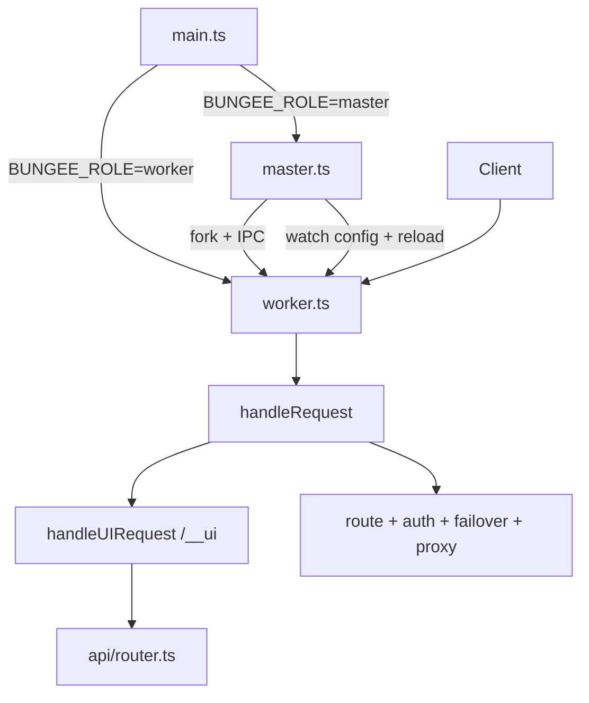

# Architecture

This document describes the current implementation architecture of Bungee.

Primary references:

- `packages/core/src/main.ts`
- `packages/core/src/master.ts`
- `packages/core/src/worker.ts`
- `packages/core/src/worker/request/handler.ts`
- `packages/core/src/ui/server.ts`
- `packages/core/src/api/router.ts`

---

## 1) Runtime Model

Bungee runs in a **master-worker multi-process model**.

- `main.ts` selects role using `BUNGEE_ROLE`.
- `master.ts` loads config, runs migrations, starts worker processes, and watches config for hot reload.
- `worker.ts` runs `Bun.serve()` and handles request traffic.

### Worker lifecycle

1. Master forks worker with env (`BUNGEE_ROLE=worker`, `WORKER_ID`, `PORT`, `CONFIG_PATH`).
2. Worker initializes runtime state, plugin registries, and HTTP server.
3. Worker sends `ready` IPC signal to master.
4. Master can issue graceful shutdown/reload commands.

---

## 2) Hot Reload Strategy

Config changes are observed in master process.

- File watch detects `config.json` changes.
- Reload is debounced.
- New workers start with updated config.
- Old workers are drained and shut down gracefully.

This enables zero-downtime style configuration updates.

---

## 3) Request Processing Pipeline

`handleRequest()` in `worker/request/handler.ts` is the orchestrator.

Processing order:

1. **UI route short-circuit**: `/__ui/*` handled by `handleUIRequest()`
2. **Health endpoint**: `/health`
3. **Route matching** against configured route table
4. **Request snapshot** creation for retry isolation
5. **Auth evaluation** (route auth overrides global auth)
6. **Expression context** construction (`headers/body/url/method/env`)
7. **Upstream selection** with priority/weight/condition
8. **Failover loop** using `FailoverCoordinator` (if route state requires)
9. **Proxy execution** and plugin hook chain
10. **Stats + request logging**

---

## 4) Control Plane vs Data Plane

- **Data plane**: reverse-proxy request processing in worker path.
- **Control plane**: UI/API endpoints under `/__ui` and `/__ui/api/*`.

UI/API serving model:

- `ui/server.ts` handles static assets and SPA fallback.
- `/__ui/api/*` is delegated to `api/router.ts`.
- `api/router.ts` handles config/routes/stats/system/plugins/logs/auth endpoints.

---

## 5) Plugin Architecture

Bungee separates plugin concerns into two layers:

1. **PluginRegistry**
   - Plugin discovery and metadata/state
   - Directory scanning and load/unload management
2. **ScopedPluginRegistry**
   - Runtime execution scope (global/route/upstream)
   - Hook precompilation and fast dispatch

Worker startup initializes both layers before serving traffic.

---

## 6) Package Boundaries (Monorepo)

| Package | Responsibility |
|---|---|
| `packages/core` | Runtime engine (master/worker, routing, plugins, API/UI serving) |
| `packages/cli` | User-facing CLI for daemon and operations |
| `packages/types` | Shared type definitions for config and plugin contracts |
| `packages/ui` | Svelte dashboard bundle used by core UI server |

---

## 7) High-Level Topology

