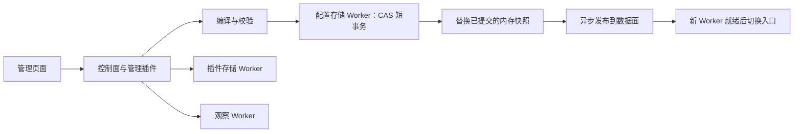

# 存储与生命周期

## 数据归属

| 数据库 | 内容 | 执行者 |
|---|---|---|
| `bungee.db` | 配置、revision、发布、恢复、监督元数据 | 配置存储 Worker |
| `plugin-state.db` | 插件状态、密钥、KV、命令日志、可靠事件、快照 | 插件存储 Worker |
| `access.db` | 请求日志、统计、插件观察数据 | 观察 Worker；数据面日志写入仍在请求 Worker |

主进程协调生命周期与消息，不执行上述数据库的查询或维护扫描。
配置快照在启动校验和成功提交后建立；普通 `getSnapshot()` 返回不可变内存投影，不执行 SQL。



提交成功和实际服务成功是两个状态。发布失败保留可用的旧 admission；停止恢复不停止已经就绪的管理插件。
完整 schema、历史关系和数据库页扫描在启动或显式 `verify()` 中运行。写事务仅校验 schema 对象指纹和当前版本关系，不扫描历史。

## 唯一插件状态接口

```ts
const record = await context.durableState.get('counter');
const [saved] = await context.durableState.transact([
  { key: 'counter', expectedVersion: record?.version ?? 0, value: 1 },
]);
const records = await context.durableState.list();
```

返回值不可修改。修改聚合对象前制作深拷贝。多条 mutation 全部提交或全部回滚；普通 CAS 不产生命令历史。
`expectedVersion: 0` 表示创建，已存在记录必须提供当前版本；删除状态可使用 `null` 值保留版本围栏。
状态与可靠事件通过同库 outbox 事务提交；可靠通道的 `publishWithState(payload, mutations)` 不接受 commandId。

有幂等要求的业务通过既有 RPC command journal 执行。`local-transaction` 纯 planner 必须声明
`atomicReadSet(execution)`，返回 `{ keys: [...] }` 或 `{ list: true }`。读集预算按本次声明读取计算；
事务提交再次校验已读版本、缺失键与完整列表，拒绝 phantom。planner 不执行外部副作用。
命令日志、业务状态和结果使用同一 SQLite 事务；外部命令继续使用已有 reconciliation 和执行者证明。

客户端的请求数量、参数字节和等待期限均有界，等待 capability 创建的调用也占用额度。
二进制参数按实际 backing buffer 计费。释放 capability 有独立的有界清理额度。
已发送写入在失联或超时时返回结果未知；幂等命令保留原 operationId，禁止换 ID 自动重执行。
释放 capability 的 ACK 不代表数据库已关闭；只有数据库关闭 ACK 才允许释放实例锁。
未确认关闭时保留锁并报告资源故障，不能把发出 terminate 当成关闭证明。

## 管理能力与健康

管理身份由选中的 `ManagementProvider` 插件实现。核心按声明发现 provider，先启动其本地 control 依赖，再启动数据面。
用户名、密码、会话、登录限流和身份恢复都属于插件；核心不按内置账户插件名分支。
选中的 provider 不可用时拒绝管理访问。没有启用管理 provider 的配置采用匿名管理；从已有认证配置切换到匿名须通过权限门禁。
无关 control 或观察 adapter 初始化失败仅影响依赖该能力的消费者。

`/health` 提供 `live`、`management`、`data`、`degraded`；没有已确认的服务 Worker 时 `data=false`。
`/health/management` 和 `/health/data` 分别检查对应就绪状态。恢复停止或发布降级不会被报告为数据面正常。

账户插件使用管理员记录、固定会话槽和限流槽。认证仅触碰对应会话；管理员 generation 撤销会话，failureEpoch 使旧限流状态失效。
普通认证不会记录完整账户命令历史。

## 数据库基线与升级

三库以版本 1 定义初始化，升级通过追加连续迁移执行。

| 数据库 | 初始基线 | 后续第一版 | 定义与注册入口 |
| --- | --- | --- | --- |
| `bungee.db` | 1 / `current_storage_baseline` | 2 | [配置 schema](../../packages/core/src/config-storage/schema.ts)、[迁移计划](../../packages/core/src/config-storage/migrations/plan.ts) |
| `access.db` | 001 / `current_access_baseline` | 002 | [日志 schema](../../packages/core/src/migrations/schema.ts)、[迁移注册](../../packages/core/src/migrations/index.ts) |
| `plugin-state.db` | `PRAGMA user_version=1` | 2 | [插件状态 schema](../../packages/core/src/plugin-state/schema.ts) |

`configuration_state.schema_version=4` 是内部状态记录格式，不是数据库迁移编号。配置 revision、监督 epoch 和插件记录版本分别标识不同对象。

新实例初始化配置库及同目录的插件状态库，日志库随正常启动创建。启动只接受受支持的迁移前缀及结构，不会自动重置不匹配的数据库。初始化不创建核心账户；身份仍归选中的管理插件。

升级约束：

1. 冻结已交付的基线和迁移；为发生变化的库追加连续版本。
2. `up(db)` 仅执行同库 SQL，不自行提交、访问外部服务或触发业务命令。
3. DDL、数据变更与迁移记录在同一事务提交；失败全部回滚。
4. 新库执行基线和增量步骤，已有库只执行未应用步骤。未知未来版本、缺失记录或结构指纹不符拒绝启动，不能将“列已存在”当作升级成功。
5. 结构变更需要覆盖数据保留、回滚和重开验证。交付前备份完整实例状态。

迁移在各库的执行 Worker 内完成；普通内存配置读取不参与迁移或维护扫描。

## 配置记录、导入和恢复

配置库保存当前规范化的 settings、services、routes、upstreams、插件 binding 和 activation，以及 revision、操作、发布、恢复和监督元数据。插件业务状态不能写进配置聚合；会话触碰也不能产生成套配置历史。

完整配置先编译校验，再用 `expected_revision` 在短事务中比较并提交。提交失败不替换投影；提交成功才替换内存快照并启动发布。冲突需重新读取和编辑，不能盲目覆盖。数据库 revision 不等于已经服务的 revision。

导出封装的 `content_hash` 校验规范化聚合内容；`source_revision` 只表示来源。导入先核对源封装 hash，再按当前 catalog 编译依赖闭包，预览与提交使用一致的整理规则。导入不替换插件业务状态、密钥或观察日志，也不直接替换运行中的数据库文件。字段与错误语义见[配置参考](../reference/configuration.md)。

发布操作绑定 revision、内容 hash、catalog、attempt 和运行身份。恢复依据持久操作状态及实际进程证据推进；不能凭超时猜测提交失败，也不能为未知业务命令换 ID 重执行。恢复进入 stopped 保留已就绪管理能力，安全重试仍走协调入口。

配置库使用 DELETE journal、FULL synchronous；插件状态库使用 WAL、FULL synchronous。两者启用外键和 5000 ms busy timeout。观察库 journal 由[日志库打开契约](../../packages/core/src/access-database.ts)选择并校验，不能在运行中由另一个连接强行切换。

JS 构建须包含配置、插件状态和观察 Worker 入口；独立二进制嵌入相同入口。关闭 ACK 是释放实例锁的前提。

身份和业务状态恢复调用[离线插件恢复](../guides/offline-recovery.md)能力。物理备份要求整个实例停止，并保留 data、logs、秘密存储密钥及 SQLite 侧文件；配置导出不能替代完整备份。
