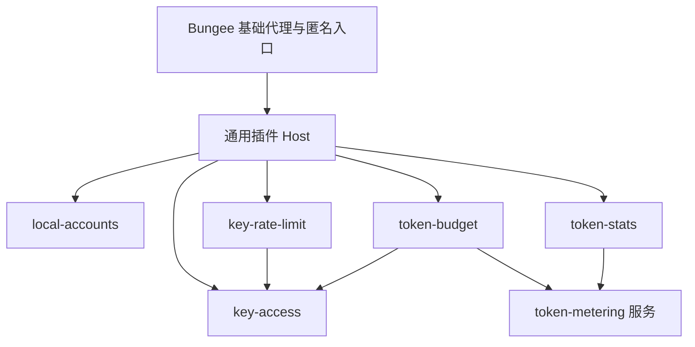

# 插件扩展架构

Bungee 的基础层负责个人反代的 Route、Service、上游及通用插件运行机制。管理默认匿名、路由默认公开；单管理员认证、Key 生命周期与路由访问控制、Key 限速、token 计量、预算和统计由可选插件提供。插件通过声明依赖与公开服务复用能力，核心不包含这些业务插件的策略、账务或 UI 字段。

本轮可核验范围及待验收项见 [实施验收记录](./authentication-implementation.md)。进程基础说明见 [运行时架构](./architecture.md)，具体行为见 [认证与访问控制设计](./authentication-authorization-design.md)，使用步骤见 [使用指南](./authentication.md)。

## 基础层和业务插件的边界

| 基础层保留 | 通过插件实现 |
| --- | --- |
| 代理路由、服务、上游、协议传输与进程管理 | 单管理员账号密码与会话 |
| 匿名管理／代理主体、管理 provider 与准入接口 | 数据面 Key 生命周期、路由保护与最终模型范围 |
| 通用只读 resource collection／extension DTO | Key ID、生成、验证、过期、撤销、速率与预算 |
| catalog、依赖图、服务注册、生命周期和作用域 | token 协议解析、usage 规范化及统计展示 |
| 通用认证入口、最终准入入口和故障拒绝机制 | 管理员会话验证、Key 授权和业务拒绝原因 |
| 通用跨进程 RPC、状态发布、持久化、秘密存储 | 管理员与会话、策略记录、周期额度与账本的内容 |
| 通用菜单、设置、资源编辑扩展和 API 门禁 | 登录表单、访问控制设置、Key 高级设置与统计组件 |

无业务插件时，管理匿名、代理公开，不需要凭证。Route 与 Service 没有认证配置；Key 生命周期和路由保护统一归访问控制插件。管理认证只管理一个管理员，没有团队与角色。

可选插件停用需要满足依赖及业务 guard。Key 限速与预算显式关闭后，新请求取消对应限制，已接纳请求使用原策略与服务租约完成；访问控制须先显式解除全部路由保护。已选择的认证 provider、受保护路由要求另有持久 guard，不能因插件故障或目录缺失自动放宽访问。

## 对计量插件的产品定位

`token-metering` 是全局服务插件，在插件中心显示，标记“提供 token 计量服务”，展示版本、健康、依赖者和启停状态。它不出现在 route、service 或 upstream 的绑定选择器中，API 也拒绝把它当 scoped 插件绑定。

| 使用方式 | 实际效果 |
| --- | --- |
| 仅启用 token-metering | 注册计量服务并等待消费者；没有消费者时不扫描请求，不建用量账本，不限流，也不生成统计页面 |
| 启用 token-stats | 自动启用 token-metering，订阅计量结果并生成原有统计；可关闭统计而不影响预算 |
| 启用 token-budget 并配置 Key 预算 | 自动启用 key-access 与 token-metering，为预算请求建立可靠计量订阅，预算插件执行准入和账务 |
| 同时启用统计和预算 | 同一个 worker 内同一 attempt 只解析一次，两个消费者独立接收结果，拥有不同的持久化和失败策略 |
| 只有消费者启用，但未设置实际预算 | 统计按自身配置消费；预算插件对无预算 Key 不施加额度限制 |

全局是实例与服务可用性的范围，不表示所有请求必须无条件计量。消费者在请求接纳前声明需求，计量插件按这些需求开始观察实际 attempt。普通 HTTP 请求无可识别 token 时，统计可记为未知；预算请求必须满足预算插件要求的可计量条件。

若将来需要“只统计某条路由”，应在统计插件增加过滤范围，而不是在计量插件建立多套 route/service 实例。本期不增加此过滤功能。Key 预算覆盖受保护路由上以 Key 接纳的调用；公开路由即使携带 Key，也解析为匿名主体，不扣该 Key 的预算。预算不能因某条受保护路由没有绑定计量插件而被绕过。

## 推荐插件划分

| 插件 | 类型与作用域 | 依赖 | 业务职责 |
| --- | --- | --- | --- |
| local-accounts | 全局管理扩展，control 进程 | 无业务依赖 | 单管理员账号、会话与管理认证 |
| key-access | 全局策略插件，control/worker/ingress | 无业务依赖 | 数据面 Key 生命周期、保护路由集合及路由／最终模型授权 |
| key-rate-limit | 全局策略插件，control/ingress | key-access | 每个 Key 的全实例速率策略 |
| token-metering | 全局服务插件，worker | 无业务依赖 | 一次解析、规范化 usage、计量来源和不完整结果 |
| token-budget | 全局策略插件，control/worker/ingress | key-access、token-metering | Key 额度、周期、准入、可靠账本与恢复 |
| token-stats | 全局观测插件，worker/control | token-metering | 统计、费用展示和可降级报表 |

以上插件全部按需启用，官方随发行版提供不等于自动开启。model-mapping 使用 scoped 模型；llm-protocol-adapter 使用 global-and-scoped，同时提供自动全局服务与显式协议转换绑定。现有路由级限流保持兼容，此次不扩大为全面重写路由限流；它与可选的 Key 限速各自生效。



业务插件直接依赖平台 SDK 不算插件依赖。统计和预算不得导入彼此的内部代码、共享彼此的数据库表，或各自再解析一次响应；它们消费 token-metering 的公开服务。计量插件内部仍可使用已有 `packages/llms` 解析器，这是它的内部实现，不把解析器变成消费者的业务接口。

## 依赖图与激活语义

### 声明和验证

沿用 manifest 的 `dependencies` 声明必需插件及版本范围。catalog 在执行插件代码前验证名称、版本范围、缺失节点、循环和跨进程服务兼容性。首期只实现必需依赖，不增加可选依赖、自动下载或多版本并存。

请求启用 A 时计算完整传递闭包。例如 A 依赖 B，B 依赖 C，一次操作将 A/B/C 的激活记录放入同一配置 revision；不是发三个独立启用请求。依赖已启用则复用，缺失、版本不匹配或依赖环则在提交前拒绝并给出依赖路径。

继续使用 revisioned `plugin_activations` 作为持久化激活真值，其中包含解析后的完整闭包。不维护第二套可写的“实际启用列表”。自动启用的来源可在操作结果中说明；当前依赖者由 manifest 图及激活集合推导。禁用消费者不自动删除已经开启的依赖，因此不需要自动垃圾回收或依赖引用计数来决定激活真值。

### 停用、卸载与完整配置写入

- 对已启用 A，必需依赖 B/C 不能禁用；阻止的是实际启用的依赖者，不是 catalog 中所有安装过的插件。
- 关闭 A 后，B/C 保持激活；没有其他启用依赖者且 A 的在途服务引用已释放时可自行关闭。排空期间展示具体引用者，不把历史依赖永久当作阻止原因。
- 卸载、升级和替换产物同样检查依赖版本、现有运行租约及状态迁移，不允许通过删文件绕过停用约束。
- 完整 PUT、导入和启动时验证激活集合闭包；不完整集合直接拒绝，不在 hash 校验后偷偷修改导入内容。交互式 enable API 负责自动补齐。
- 自依赖和依赖环直接拒绝，不通过不确定的初始化顺序处理。

依赖拓扑控制初始化和服务就绪顺序，不替代 Hook 阶段顺序。request 变换、最终准入、原始响应计量和响应变换是框架定义的不同边界，不能仅靠 priority 数字保证预算正确。

### 作用域约束

激活和 scoped binding 是两种状态。开启一个 scoped 插件不等于它对所有请求执行；依赖解析不能自动复制未知的 route/service options。

首期跨插件服务依赖只接受全局 provider。消费者可以是 global 或 scoped：scoped 消费者依赖全局 provider，不会扩大消费者自身覆盖的请求范围。global 消费者要求全局 provider。scoped-to-scoped 服务依赖暂不支持，避免制造不清楚的绑定继承与多实例选择。

现有不使用新服务契约的 scoped 插件按原规则执行。token-metering 的 global 范围保证预算消费者的任何目标请求均能取得同一种服务。

## 插件服务契约

manifest 的 `services` 声明提供和消费的服务 ID、整数契约版本与运行进程，strict parser 和依赖图共同验证。首期服务句柄仅运行于 worker，同进程使用类型化 SDK；跨进程业务操作经受控 state RPC，平台验证请求身份、版本、大小和期限，插件验证业务载荷。

消费声明片段（完整 manifest 仍需入口、作用域等字段）：

```json
{
  "name": "token-budget",
  "dependencies": { "key-access": "^1.0.0", "token-metering": "^1.0.0" },
  "services": { "consumes": [{
    "plugin": "token-metering",
    "id": "token-metering.v1",
    "version": 1,
    "process": "worker"
  }] }
}
```

Host 在 provider 就绪后将只读、可撤销的服务句柄注入消费者。只有显式声明的依赖才能取得句柄；不能按任意插件名读取别人的 storage 或直接取得插件实例。

同进程调用使用句柄，跨进程调用由 Host 提供认证的 RPC 代理，不传递 JavaScript 对象引用。RPC 必须有严格 schema、大小和超时限制，并绑定 caller 插件、服务版本、运行代际、请求/attempt 和目标进程身份。当前 bound-attempt RPC 不能不经扩展就用于管理认证或 ingress 策略调用。

依赖只约束声明过的边，不允许消费期间动态查找任意服务。调用图及服务引用同样不能成环；超时后的迟到回调不能继续使用已撤销存储 capability 写入旧状态。

### 计量服务的具体职责

worker 中的 token-metering 接收框架提供的最终请求与原始上游响应流，先于响应转换观察 usage。服务输出稳定的 request/attempt ID、实际模型、规范化 input/output、来源、完整性及结算版本。

输入和输出各自优先采用官方 usage，缺失时接受可用的本地估算，并分别标记来源和完整性。后续官方结果替换对应估算，不能重复累加。无法计量或估算的部分输出为 unknown，不填零；预算消费者据此阻止受影响 Key 的新预算请求，统计消费者按不完整展示。

消费者在接纳前注册需求：token-stats 使用可降级订阅；token-budget 使用必需订阅。存在必需订阅时，协议能力检查、attempt 观察准备及失败反馈必须可确认。一个消费者慢或失败不应阻塞另一个消费者；预算故障必须回到预算插件的状态机，而不是被报表 Hook 吞掉。

计量插件不存储 Key 的额度，不决定是否放行，不持有管理身份，不查询统计插件账本。它报告无法计量及观察丢失；消费者决定这些状态的业务后果。无消费者时不建立观察流；两个消费者同时订阅同一 attempt 时共享解析状态但不共享可写账本。

## 扩展点与最终请求执行

平台新增的是通用扩展点，不能将“如果插件名是 token-budget”写入 core。

| 扩展点 | 平台保证 | 插件负责 |
| --- | --- | --- |
| management.authenticate | 唯一选中的提供者、互斥模式、错误不回退 | 验证账号会话并输出管理主体 |
| management.authorize | API 声明能力及当前主体传入，拒绝结果强制执行 | 验证当前管理员会话并授权 |
| data.finalAdmission | 最终目标冻结、身份插件最新状态、持久保护 guard、单次外部请求许可 | 范围、速率、预算业务判断 |
| data.beforeAttempt | 每次发送前执行，绑定请求及 attempt 租约 | 故障转移目标检查、必要准备和账务登记 |
| transport.observeRaw | 请求和原始响应的通用观察及显式完整性 | LLM 解析及 token 规范化 |
| plugin.lifecycleGuard | 生命周期与状态编辑串行化、在途引用可追踪 | 认证切换证明、路由保护停用检查、迁移及清理保护；限速／预算策略不阻止明确停用，租约推迟销毁 |
| plugin.statePublish | 持久化版本、发布 ACK、代际隔离及恢复操作 | 策略内容和账务状态的生成 |

首期准入链只有纯 validate、可取消 prepare，以及 Host 的共同最终决定，不提供通用的跨插件分布式 commit。所有初步校验成功后才能 prepare；跨进程 prepare 仅允许建立绑定 request/attempt ID 的 pending 记录或订阅租约，不能永久扣减额度或速率。某个准备失败或结果未知时不发许可，按同一 ID 查询并取消已确认准备项；未确认项进入可恢复状态，不能换 ID 重试。预算 pending 不预留 token，未发送时可幂等取消。

ingress 在最终准入序列内通过插件重新校验主体、全部策略版本和准备证明，再运行无 I/O、不可 await 的插件校验及状态计划。插件只能返回 Host 管理的命名空间内存状态写集合，不能在此阶段自行向其他进程提交、执行存储写入或直接修改计数。Host 在临时状态视图中完成所有计划，任一拒绝、异常或冲突都丢弃全部计划；全部成功后，通过一次状态根替换同时发布插件状态变化和 request ID 的发送许可。Key 速率扣减与许可由此拥有共同决定点，不存在先扣成功再被另一个插件拒绝的可见中间态。核心理解的是通用状态事务与许可，不解释桶、token 或预算字段。

撤销与共同决定在 ingress 同一序列中排序。prepare 的所有 await 之后重新校验，旧许可不能复用于客户端新的 HTTP 请求。所有共同决定按 request ID 幂等查询，许可绑定原请求和运行代际；worker 丢失响应时先查询，不重新产生决定或第二次扣减。决定之前取消不提交任何计数；决定之后客户端取消仍算一次已接纳请求，不回滚速率，未发送的预算 pending 可标记取消。ingress 崩溃导致决定证据丢失时，旧代际不能重新授权该请求；预算账务按 pending 恢复，速率桶按已经定义的重启规则重建。

不能满足上述副作用限制的插件只能注册纯校验，不能参与最终状态计划。真正的账务结算发生在 attempt 计量之后，使用独立的幂等持久化协议，不纳入这一内存决定。最终请求目标或策略版本变动时，必须重新 prepare/校验后才进入共同决定，不允许继续使用旧计划。

已有请求固定其认证和插件策略快照。后续内部 attempt 不重复扣 Key 外部请求速率，不重新检查因后续撤销或预算耗尽而变化的准入条件，但仍运行原策略的目标检查和 attempt 准备。只有全部必需步骤成功才发送。

## 多进程分工

当前 master、ingress 和 worker 的进程形态保持，改变的是“谁拥有业务实现”。

| 进程 | 平台 Host | 本期运行的插件职责 |
| --- | --- | --- |
| master/control | 管理 API、唯一持久化 writer、插件迁移和状态发布 | local-accounts，Key 策略编辑，预算账本事务，统计 API |
| ingress | 全实例准入序列、通用身份验证与持久保护 guard、策略 Host | key-access 验证 Key 与最终范围，Key 限流桶，预算准入计数 |
| worker | scoped Hook、目标冻结、原始传输观察、服务句柄 | 最终模型提取，token-metering，预算 attempt 准备与结算提交 |

ingress Host 仅加载 manifest 显式 ingress entry；不将全部 worker 插件或 UI 包加载到 ingress。manifest 区分代码运行进程和请求作用域，global 表示每个声明进程中的实例范围，不表示插件同时在所有进程执行。

Key 访问范围等策略从 master 发布到 ingress，worker 只提供实际目标和同请求的计量。每个 worker 的计量 provider 各有实例，ingress 的每 Key 桶及预算准入状态全实例只有一份；global 不能被理解为“整个部署只有一个 JS 对象”。

当前插件 RPC 会验证当前 worker、配置 revision 和绑定，不能照搬为新服务 RPC。通用 RPC 区分新请求、仍有租约的 drain worker 在途调用、控制面调用，防止切换配置后拒绝原 worker 的合法结算，也防止已退出 worker 的旧消息继续有效。

## 状态与持久化

Key 真值与生命周期由 key-access 插件的耐久状态及发布协议负责。该插件保存凭证摘要、撤销状态、保护集合和每 Key 授权；key-rate-limit 与 token-budget 按稳定 Key ID 保存各自策略。管理员、会话与预算账本归相应插件。

core 提供 collection 和 resource extension 的通用只读 Host：按 manifest 声明加载 DTO reader，只传入 `get/list`，不启动已停用插件，不授予写权限。创建和撤销 Key 属于插件 API。平台独立持久化管理 provider 选择与受保护路由要求，catalog 目录缺失或读取异常不能抹掉这些保护。

为插件增加受控的 durable-state capability：master 独占 `bungee.db` 写入，插件经 Host 调用事务、CAS 和幂等命令；插件不取得配置库的裸连接。Host 维护通用命名空间和版本，插件声明严格记录 schema 和纯数据迁移。命名空间隔离是 SDK 能力边界，不声称同进程第三方代码已被沙箱化；安装插件代码仍属于可信管理操作。

沿用 `logs/access.db` 的普通插件 KV 与观测 storage 可继续承载报表，不能作为强制预算的唯一权威。核心提供耐久机制，不提供 token 字段、月额度逻辑或“仅 token-stats 才能访问”的特例。统计 SQL 已迁入 token-stats；历史表及数据保持兼容。普通 PluginStorage 提供可撤销 observation 与 uncached KV 能力，配置库不能获得 observation 连接。预算不使用这些能力保存强制账务。可信插件可访问观测库，该能力不提供 SQL 沙箱。

| 持久化内容 | 所有者 | 是否受日志清理影响 |
| --- | --- | --- |
| 数据面 Key 摘要、授权、保护集合与撤销 | key-access | 否 |
| 单管理员及会话 | local-accounts | 否 |
| 管理 provider 选择、路由保护 guard | core 通用 Host | 否 |
| 访问范围、Key 速率策略 | 对应策略插件 | 否 |
| 预算策略、attempt、周期账本 | token-budget | 否 |
| 统计聚合、价格缓存、图表数据 | token-stats | 按其保留策略 |
| 计量解析临时状态 | token-metering | 不属于持久化真值 |

停用保留插件状态，重新启用不清零额度；卸载代码不自动删除数据。显式清理命名空间需要通过 lifecycle guard，不能有未结算记录或引用该状态的运行租约。Key 撤销不删除尚需结算的对象身份；Key ID 永不复用。

停用期间保留的策略不作用于新请求，重新启用恢复原策略与账务，不追溯计入停用期间接纳的流量。未知账务不阻止明确停用，但必须保留恢复证据；重新启用预算时，受影响 Key 在恢复完成前不能接纳新的预算请求。

普通代理配置导入导出不替换管理员、Key 或插件耐久运行状态。对于身份插件选择、激活集合和引用安全状态的配置，导入必须经过相同授权与 lifecycle 校验，不因它是“代理配置导入”而绕过管理认证切换保护。

## 两类发布与生命周期

插件代码、激活集合和 scoped binding 仍走配置 revision 和 worker 滚动发布。Key 变更与插件动态策略走独立的通用状态版本发布，不为额度或撤销替换整个 worker。基础层只理解版本、身份、持久保护要求、发布结果和必需扩展是否就绪，不解释策略内容。

初始化按依赖拓扑：catalog 验证 → provider 初始化 → 服务 ready → consumer 初始化 → 必需扩展校验 → 接纳新请求。control、ingress 和目标 worker 均报告同一 catalog/依赖图版本及所需服务 readiness，才允许相应运行代际服务。

候选运行时未 ready 时继续原 serving 代际。配置已提交而运行发布失败，返回 degraded/pending，不回滚数据库，不报告启用完成。不可因为新插件失败就向外提供缺少该强制策略的新运行代际。依赖关闭或故障时，已配置的必需扩展保留失败状态，相关新请求拒绝，不静默跳过。

停用执行：授权 → 锁定配置及相关状态版本 → 检查依赖、路由保护和认证切换 guard → 准备不含该消费者的新代际 → 协调准入切换 → 原请求排空和恢复 → 逆拓扑销毁。Key 限速／预算的有效策略、在途请求及待结算记录不阻止其停用切换，它们决定旧实例与状态何时能释放；清理数据和卸载代码仍须等待引用及未结算记录解除。

插件激活发布与 ingress 策略切换使用一个协调操作。新 worker 及其余必需扩展 ready 后，在 ingress 最终准入序列确定切换点。此后新请求不执行已停用插件；尚未取得许可的旧 prepare 必须取消并按新代际重新准备、校验，不能沿用旧计数计划或发送许可。切换前已获许可的请求按原快照执行。新请求仍须满足保留的保护要求及其他启用插件的规则。

操作状态区分 pending、新请求已切换但 draining、完全 stopped；切换确认前不能报告限制已取消。排空中的实例仅服务已有请求租约及幂等结算、恢复，不接受新的订阅或业务需求；原请求允许按原策略建立后续 attempt。消费者引用释放前不得销毁 provider，不能把新 revision 中不再激活当成旧实例立刻可卸载。停用本身不强制中断流，原请求超时和故障处理规则继续生效。

排空期间重新启用创建独立运行代际，复用同一耐久命名空间与幂等 ID。新旧代际的结算通过同一 writer 去重，不能初始化空账本；预算新准入先恢复必要账务，不能用重新启用绕过未知结果。

## 可选功能的关闭与故障

| 场景 | 行为 |
| --- | --- |
| 未启用业务插件 | 匿名管理、公开代理，无需凭证 |
| 关闭 token-stats，预算仍启用 | 新请求不订阅统计，原订阅排空；计量仍被预算依赖，预算正常执行 |
| 关闭 token-metering，但有消费者激活或排空租约 | 拒绝并列出依赖者或在途引用者 |
| 关闭 token-budget，但仍有有效预算策略或待结算/在途请求 | 允许切换，新请求不受预算限制；原请求继续计量结算，状态保留，旧实例延后释放 |
| 关闭 key-rate-limit，但仍有有效策略 | 允许切换，新请求取消限速；保留策略，原请求使用原快照 |
| 关闭 key-access，但仍有受保护路由或启用依赖者 | 拒绝，须先解除全部保护并停用依赖者 |
| key-access 故障、保护状态读取失败或目录缺失 | 持久 guard 保留已有保护，不能变为公开 |
| 账务不完整时明确关闭预算，再重新启用 | 停用后新请求无预算限制；恢复证据保留，重新启用时受影响 Key 仍须恢复账务 |
| local-accounts 故障或候选初始化失败 | 保持管理认证模式，不自动恢复匿名管理 |
| 计量失败，只有统计消费 | 统计标为不完整，不因报表故障终止代理流 |
| 计量失败，有预算消费 | 已发送流继续；预算插件阻止新的预算请求并进入恢复 |
| master 不可用 | 无需 durable prepare 的既有策略按可信 ingress 状态继续；需要耐久登记的新预算 attempt 拒绝 |
| provider 原进程崩溃 | 不承诺流连接存活；重新服务前恢复版本及必要状态 |

管理认证未启用时允许匿名管理；启用时所有管理操作要求唯一管理员的有效会话。停用认证须验证当前身份，完成切换后恢复匿名。没有成员或角色分级。

## 插件中心与 SDK 界面

插件中心所有已安装插件可见，包括只提供服务的插件。展示：类型、支持作用域、运行进程、声明依赖、当前被谁依赖、服务健康、期望激活状态、实际发布状态及停用阻止原因。服务插件的“无 route/service 绑定”是正常状态，不显示为未使用故障。

依赖自动开启由操作结果列出，禁用按钮显示不能关闭的具体原因，API 同样强制检查。Key 限速与预算可直接关闭；访问控制须先解除全部保护。界面说明哪些限制取消、哪些 guard 尚未满足及数据保留情况。展示期望停用、新请求已切换、排空及完全停止；provider 分别显示启用依赖者和排空引用者，二者均为空时可关闭。

访问控制插件设置页统一维护 Key 与路由保护；创建 Key 时选择允许路由，明确同意后才把所选公开路由加入保护。保护集合与授权范围分开，最后一个 Key 撤销不解除保护。core 通过通用 resource extension 读取高级策略摘要及停用后的只读状态。

管理认证未启用时 Dashboard 直接进入；选中 local-accounts 后显示单管理员账号密码表单。core 呈现当前 provider UI，不维护账号表。插件 API 能力声明交给管理 provider 执行，单管理员具备完整管理权限。

插件开关保留原有 BSwitch；依赖或 guard 不能满足时 disabled，并说明具体原因，不修改基础组件样式。

## 实现定位

- [依赖图](../packages/core/src/plugin-dependencies.ts)验证启用闭包、版本、循环与服务声明；[manifest parser](../packages/core/src/plugin-manifest-catalog/manifest-parser.ts)严格解析新增契约。
- [服务 Host](../packages/core/src/plugin-services.ts)与 [scoped registry](../packages/core/src/scoped-plugin-registry.ts)管理声明、就绪和在途租约。
- [准入 Host](../packages/core/src/data-admission/host.ts)、[worker 协调](../packages/core/src/data-admission/worker.ts)及 [RPC](../packages/core/src/data-admission/rpc.ts)执行版本复核、可取消准备与共同决定。
- [耐久状态](../packages/core/src/plugin-durable-state.ts)提供命名空间、CAS 和幂等命令；[离线恢复](../packages/core/src/master-runtime/offline-recovery.ts)持实例锁调用插件恢复能力。
- [观测存储](../packages/core/src/plugin-storage.ts)提供通用能力，[统计 SQL](../plugins/token-stats/server/storage.ts)归统计插件所有。原表迁移保留兼容，旧 `metering` 类型仅支持显式组装的 embedder。

## 实现拆分

| 步骤 | 需要修改的实现域 | 交付物 |
| --- | --- | --- |
| 1 基础身份边界 | types、管理/公共入口、CLI/UI、config-storage | 匿名默认、provider、持久 guard、删除旧共享 auth |
| 2 依赖图 | manifest/catalog、配置编译/校验、激活 API、发布 ACK | 依赖闭包、版本/循环校验、启动及停用拓扑 |
| 3 服务和运行 Host | plugin SDK、control、worker、ingress、内部 RPC | provider/consumer 句柄、严格 schema、进程声明、租约 |
| 4 通用状态和准入 | config-storage、状态发布、finalAdmission、beforeAttempt、管理入口 | durable-state、版本 CAS、可取消 prepare、共同内存决定及查询、认证 provider 切换 |
| 5 计量与统计拆分 | plugins/token-metering、plugins/token-stats、原始传输边界、旧 metering storage | 共享计量服务，统计消费，不依赖统计队列执行预算 |
| 6 可选业务插件 | plugins/local-accounts、key-access、key-rate-limit、token-budget | 单管理员、Key 生命周期、路由保护、范围、速率和预算 |
| 7 产品与迁移 | plugin center、Key 扩展表单、登录、CLI、文档、故障测试 | 清楚展示能力来源，安全迁移和完整验收 |

服务注册、状态存储和准入接口先完成，再把业务实现迁出核心，避免出现名称上是插件、实质仍是核心分支的结果。每一步包括契约和集成验证，业务插件遵守声明依赖，组成用户需要的功能组合。

## 架构验收

1. 无业务插件时匿名管理、公开代理；core 没有账号表、Key 生命周期或预算业务字段。
2. 管理认证建立或验证一个管理员，停用恢复匿名；插件故障与目录缺失不清除持久认证选择。
3. 访问控制统一维护 Key 和保护集合，授权与保护分开；撤销最后 Key 不公开路由，空授权拒绝全部。
4. 公开路由携带 Key 仍匿名；Key 限速和预算只对受保护的 Key 请求生效。
5. 依赖启用闭包完整；缺失版本、依赖环、不完整导入和不满足停用 guard 均拒绝。
6. token-metering 为全局服务，不可绑定 Route／Service；统计不依赖访问控制。
7. provider 未 ready 不能发布对应强制能力的新 serving 代际；持久 guard 防止插件异常绕过保护。
8. 准入共同决定、版本复核和幂等查询防止部分扣减；撤销不打断已取得许可的流。
9. budget/stats 共享 attempt 解析，分别持有账本；观测日志清理和统计故障不清空预算。
10. 官方 usage 优先、估算来源可见、差额结算；无法计量不计零，重新启用不能绕过账务恢复。
11. 停用消费者后保留状态并排空租约，provider 被引用时不能关闭；通用只读资源可读取停用扩展。
12. 本地恢复要求整个实例停止，插件实现 identity／plugin-state 恢复；普通导入不覆盖运行状态。

本轮已核验范围见 [实施记录](./authentication-implementation.md)，上述架构标准不等于全部浏览器或生产验收已经完成。

## 统一网关装配与 SDK 3 内容需求边界

核心 HTTP 入口、路由、准入、选择、重试、请求规则、转发、响应规则、日志和正文服务都经 `Plugin.register(hooks)` 装配。正文服务通过同一 BaseHook 上的同步 `onGatewayBody` 提供者创建唯一 BodySource；没有第二套正文容器。启动校验每个必需阶段恰好一个 provider，缺失或重复直接失败。AsyncLocalStorage 固定本请求的运行装配，配置发布不替换在途请求快照；scoped 插件继续按原作用域顺序执行。

插件核心导入仅允许 `@jeffusion/bungee-core/plugin`，禁止源码或 dist 深层导入。SDK 暴露 BodyHandle 类型与上下文内的受控句柄，不暴露建立 reader 的运行时 factory；控制面 SDK 不因正文类型导入而加载 node:zlib。所有随发行插件统一使用新 SDK，不提供兼容声明。

正文视图区分 original-request、outbound-request、upstream-response、client-response，绑定 request/attempt、版本、媒体及编码。响应瀑布在每个 tap 后更新表示；只读操作复用冻结缓存，写操作产生新版本。完整正文生命周期、WebSocket 尚未实现的边界及自动局部忽略旧配置的规则见 [HTTP 正文架构](./http-body-architecture.md)。

代理默认按 opaque 字节流传输。所有 runtime 插件/handler 必须实现 `bodyRequirements(context)`；manifest schema 为 3，缺方法明确初始化失败，不使用旧插件或兼容声明回退。需求按当前方法、URL、路由和已选择的 Service/Upstream 求值，未选中的 endpoint 插件不能要求读体。

请求需求区分 `none`、`json-read`、`json-write`：只读视图保留原始 wire，只有显式改写才序列化；响应需求为 `('json' | 'sse-json')[]`，重放通过独立 `replay` 声明。功能关闭、元数据操作、模型从 URL 可取得时不因 Hook 存在读取内容。有效预算和模型授权通过准入策略声明必需 JSON，无策略不会触发强制解析。

统计的 optional observe 独立于强制内容需求。token-metering 无消费者时不解析，有消费者时通过 BodyHandle 复用 wire、decoded、JSON 和 SSE 事件缓存；日志与 Token 可分别关闭，消费者的积压、期限、失败及取消互相隔离。HTTP body_parser_limit、worker 并发资源预算、日志保存配额是三个边界，不把日志保存上限变成统计或 HTTP 内容上限。gzip/zstd 在中央按需解码，同一表示正常计算只解析一次。超限、解码失败、不支持编码和慢消费者标记 incomplete 并继续主流；未知用量不填零。预算强制准入和可靠结算仍失败关闭。

资源默认及证据见 [正文共享资源测量](./body-resource-measurements.md)。根据八并发重复/混合文本测量，必要/可选解码器基线调整为八个；800 KiB 与 2 MiB 样本均完整，不承诺任意压缩请求并发。架构 CI 检查与负例测试在构建前执行；管理 API、OAuth、账号 usage 和模型目录是辅助网络边界，不能据此允许代理插件自行读取 HTTP 正文。

SSE Hook 使用独立封套 `{data,json?,event?,id?,retry?,comments?,raw?}`，原始事件元数据与 JSON 分离，禁止 `_event` 注入及按 payload.type 重建原始 event。转换器显式生成新协议事件，N:M 输出各自封套。
